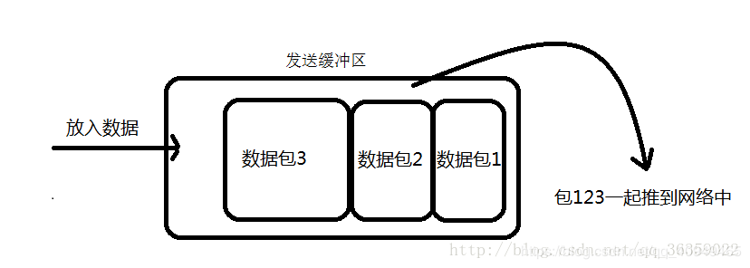
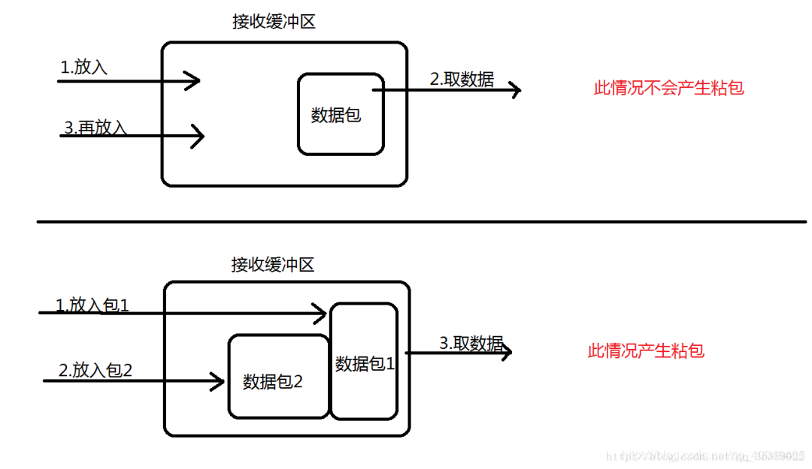
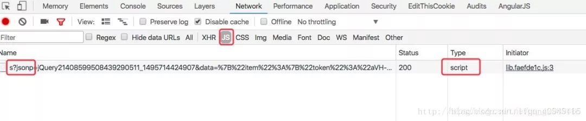
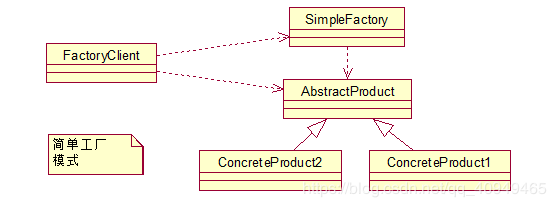
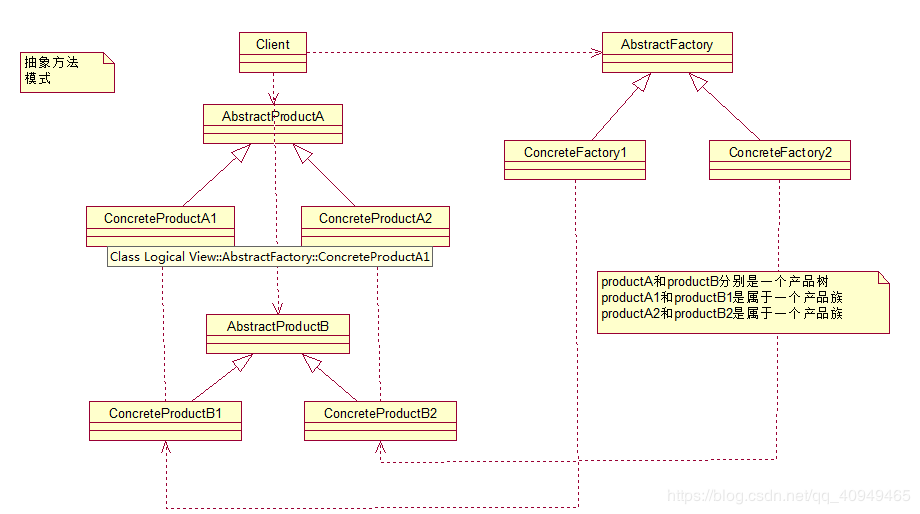

79. http 响应码 301 和 302 代表的是什么？有什么区别？

    301：表示旧地址A的资源已经被永久地移除了（这个资源不可访问了），搜索引擎在抓取新内容的同时也将旧的网址交换为重定向之后的网址；（代表永久性转移(Permanently Moved)）

    302：表示旧地址A的资源还在（仍然可以访问），这个重定向只是临时地从旧地址A跳转到地址B，搜索引擎会抓取新的内容而保存旧的网址 （代表暂时性转移(Temporarily Moved )）

    答案：

    301，302 都是HTTP状态的编码，都代表着某个URL发生了转移。

    区别：

    301 redirect: 301 代表永久性转移(Permanently Moved)。

    302 redirect: 302 代表暂时性转移(Temporarily Moved )。 

80. forward 和 redirect 的区别？

    forward ：请求转发，不会跳转页面

    redirect ：重定向，会跳转页面

    答案：

    Forward和Redirect代表了两种请求转发方式：直接转发和间接转发。

    直接转发方式（Forward），客户端和浏览器只发出一次请求，Servlet、HTML、JSP或其它信息资源，由第二个信息资源响应该请求，在请求对象request中，保存的对象对于每个信息资源是共享的。

    间接转发方式（Redirect）实际是两次HTTP请求，服务器端在响应第一次请求的时候，让浏览器再向另外一个URL发出请求，从而达到转发的目的。

    举个通俗的例子：

    直接转发就相当于：“A找B借钱，B说没有，B去找C借，借到借不到都会把消息传递给A”；　

    间接转发就相当于："A找B借钱，B说没有，让A去找C借"。

81. 简述 tcp 和 udp的区别？

    tcp：面向连接的传输层协议；提供可靠交付；面向字节流

    udp：不需要建立连接，开销小，尽最大努力进行交付，不提供可靠交付；无拥塞控制，面向字符流

    答案：

    * TCP面向连接（如打电话要先拨号建立连接）;UDP是无连接的，即发送数据之前不需要建立连接。

    * TCP提供可靠的服务。也就是说，通过TCP连接传送的数据，无差错，不丢失，不重复，且按序到达;UDP尽最大努力交付，即不保证可靠交付。

    * Tcp通过校验和，重传控制，序号标识，滑动窗口、确认应答实现可靠传输。如丢包时的重发控制，还可以对次序乱掉的分包进行顺序控制。

    * UDP具有较好的实时性，工作效率比TCP高，适用于对高速传输和实时性有较高的通信或广播通信。

    * 每一条TCP连接只能是点到点的;UDP支持一对一，一对多，多对一和多对多的交互通信。

    * TCP对系统资源要求较多，UDP对系统资源要求较少。

82. tcp 为什么要三次握手，两次不行吗？为什么？

    两次握手话，客户端给服务端发送一次建立连接的请求（SYN-SEND），此时网络拥堵会再次发送建立连接的请求。此时服务端收到给客户端请求回复（SYN-REC），客户端收到建立连接。此时客户端第一次发送的请求又到了服务端，但是此时已经建立过了，这样就会浪费网络资源。

    《码农翻身》这样解释到：

    第一次握手：客户端发信，服务端收到了。此时服务端就会明白客户端的发信能力和自己收信能力没问题

    第二次握手：服务端发信，客户端收到了。此时客户端就会明白服务端的发信和收信能力都是没问题的、自己收信和发送能力也是没问题，但是服务端还不知道自己的发信能力如何，所以需要第三次握手

    第三次握手：客户端发信，服务端收到了。其实第二次握手的时候客户端已经明白，双方通信是没问题的，此次回应的目的是消除服务端对自己的发信能力，和客户端收信能力的担忧

    答案：

    为了实现可靠数据传输， TCP 协议的通信双方， 都必须维护一个序列号， 以标识发送出去的数据包中， 哪些是已经被对方收到的。 三次握手的过程即是通信双方相互告知序列号起始值， 并确认对方已经收到了序列号起始值的必经步骤。

    如果只是两次握手， 至多只有连接发起方的起始序列号能被确认， 另一方选择的序列号则得不到确认。

83. 说一下 tcp 粘包是怎么产生的？

    答案：

    1. 发送方产生粘包

        

        采用TCP协议传输数据的客户端与服务器经常是保持一个长连接的状态（一次连接发一次数据不存在粘包），双方在连接不断开的情况下，可以一直传输数据；但当发送的数据包过于的小时，那么TCP协议默认的会启用Nagle算法，将这些较小的数据包进行合并发送（缓冲区数据发送是一个堆压的过程）；这个合并过程就是在发送缓冲区中进行的，也就是说数据发送出来它已经是粘包的状态了。

    2. 接收方产生粘包

        

        接收方采用TCP协议接收数据时的过程是这样的：数据到底接收方，从网络模型的下方传递至传输层，传输层的TCP协议处理是将其放置接收缓冲区，然后由应用层来主动获取（C语言用recv、read等函数）；这时会出现一个问题，就是我们在程序中调用的读取数据函数不能及时的把缓冲区中的数据拿出来，而下一个数据又到来并有一部分放入的缓冲区末尾，等我们读取数据时就是一个粘包。（放数据的速度 > 应用层拿数据速度） 

84. OSI 的七层模型都有哪些？

    应用层  能够产生网络流量；能够和用户交互的应用程序

    表示层  加密 压缩

    会话层  服务端与客户端建立会话

    传输层  tcp/udp 拥塞控制，流量控制，建立可靠传输，不可靠传输，

    网络层  路由选择最佳路径

    数据链路层   封装成帧（MAC帧）透明传输 差错控制

    物理层  如何在物理媒介上传输比特流

    答案：

    * 应用层：网络服务与最终用户的一个接口。
    * 表示层：数据的表示、安全、压缩。
    * 会话层：建立、管理、终止会话。
    * 传输层：定义传输数据的协议端口号，以及流控和差错校验。
    * 网络层：进行逻辑地址寻址，实现不同网络之间的路径选择。
    * 数据链路层：建立逻辑连接、进行硬件地址寻址、差错校验等功能。
    * 物理层：建立、维护、断开物理连接。
 
85. get 和 post 请求有哪些区别？

    get请求：                                                                     post请求

    将参数放在URL后面拼接明文显示，不安全           参数是在请求体中，浏览器地址栏没有明文显示，安全

    提交的数据最大2kb，取决于浏览器的限制            理论上没有限制 

    在浏览器回退是无害的                                           会再次提交请求

    主动被浏览器缓存                                                  不会主动，除非主动设置

    答案：

    * GET在浏览器回退时是无害的，而POST会再次提交请求。

    * GET产生的URL地址可以被Bookmark，而POST不可以。

    * GET请求会被浏览器主动cache，而POST不会，除非手动设置。

    * GET请求只能进行url编码，而POST支持多种编码方式。

    * GET请求参数会被完整保留在浏览器历史记录里，而POST中的参数不会被保留。

    * GET请求在URL中传送的参数是有长度限制的，而POST么有。

    * 对参数的数据类型，GET只接受ASCII字符，而POST没有限制。

    * GET比POST更不安全，因为参数直接暴露在URL上，所以不能用来传递敏感信息。

    * GET参数通过URL传递，POST放在Request body中。

86. 如何实现跨域？

    答案：

    1. 图片ping或script标签跨域
        
        图片ping常用于跟踪用户点击页面或动态广告曝光次数。 
        script标签可以得到从其他来源数据，这也是JSONP依赖的根据。

    2. JSONP跨域

        
        JSONP（JSON with Padding）是数据格式JSON的一种“使用模式”，可以让网页从别的网域要数据。根据 XmlHttpRequest 对象受到同源策略的影响，而利用 \<script\>元素的这个开放策略，网页可以得到从其他来源动态产生的JSON数据，而这种使用模式就是所谓的 JSONP。用JSONP抓到的数据并不是JSON，而是任意的JavaScript，用 JavaScript解释器运行而不是用JSON解析器解析。所有，通过Chrome查看所有JSONP发送的Get请求都是js类型，而非XHR。 

        

        缺点：

        * 只能使用Get请求

        * 不能注册success、error等事件监听函数，不能很容易的确定JSONP请求是否失败

        * JSONP是从其他域中加载代码执行，容易受到跨站请求伪造的攻击，其安全性无法确保

    3. CORS
        
        Cross-Origin Resource Sharing（CORS）跨域资源共享是一份浏览器技术的规范，提供了 Web 服务从不同域传来沙盒脚本的方法，以避开浏览器的同源策略，确保安全的跨域数据传输。现代浏览器使用CORS在API容器如XMLHttpRequest来减少HTTP请求的风险来源。与 JSONP 不同，CORS 除了 GET 要求方法以外也支持其他的 HTTP 要求。服务器一般需要增加如下响应头的一种或几种：

        ```
        Access-Control-Allow-Origin: *
        Access-Control-Allow-Methods: POST, GET, OPTIONS
        Access-Control-Allow-Headers: X-PINGOTHER, Content-Type
        Access-Control-Max-Age: 86400
        ```

        跨域请求默认不会携带Cookie信息，如果需要携带，请配置下述参数： 

        "Access-Control-Allow-Credentials": true
        // Ajax设置
        "withCredentials": true

    4. window.name+iframe
        
        window.name通过在iframe（一般动态创建i）中加载跨域HTML文件来起作用。然后，HTML文件将传递给请求者的字符串内容赋值给window.name。然后，请求者可以检索window.name值作为响应。

        iframe标签的跨域能力；

        window.name属性值在文档刷新后依旧存在的能力（且最大允许2M左右）。

        每个iframe都有包裹它的window，而这个window是top window的子窗口。contentWindow属性返回\<iframe\>元素的Window对象。你可以使用这个Window对象来访问iframe的文档及其内部DOM。

        ```html
        !-- 
        下述用端口 
        10000表示：domainA
        10001表示：domainB
        -->
        
        <!-- localhost:10000 -->
        <script>
        var iframe = document.createElement('iframe');
        iframe.style.display = 'none'; // 隐藏
        
        var state = 0; // 防止页面无限刷新
        iframe.onload = function() {
            if(state === 1) {
                console.log(JSON.parse(iframe.contentWindow.name));
                // 清除创建的iframe
                iframe.contentWindow.document.write('');
                iframe.contentWindow.close();
                document.body.removeChild(iframe);
            } else if(state === 0) {
                state = 1;
                // 加载完成，指向当前域，防止错误(proxy.html为空白页面)
                // Blocked a frame with origin "http://localhost:10000" from accessing a cross-origin frame.
                iframe.contentWindow.location = 'http://localhost:10000/proxy.html';
            }
        };
        
        iframe.src = 'http://localhost:10001';
        document.body.appendChild(iframe);
        </script>
        
        <!-- localhost:10001 -->
        <!DOCTYPE html>
        ...
        <script>
        window.name = JSON.stringify({a: 1, b: 2});
        </script>
        </html>
        ```

    5. window.postMessage()
        
        HTML5新特性，可以用来向其他所有的 window 对象发送消息。需要注意的是我们必须要保证所有的脚本执行完才发送 MessageEvent，如果在函数执行的过程中调用了它，就会让后面的函数超时无法执行。

        下述代码实现了跨域存储localStorage

        ```html
        <!-- 
        下述用端口 
        10000表示：domainA
        10001表示：domainB
        -->
        
        <!-- localhost:10000 -->
        <iframe src="http://localhost:10001/msg.html" name="myPostMessage" style="display:none;">
        </iframe>
        
        <script>
        function main() {
            LSsetItem('test', 'Test: ' + new Date());
            LSgetItem('test', function(value) {
                console.log('value: ' + value);
            });
            LSremoveItem('test');
        }
        
        var callbacks = {};
        window.addEventListener('message', function(event) {
            if (event.source === frames['myPostMessage']) {
                console.log(event)
                var data = /^#localStorage#(\d+)(null)?#([\S\s]*)/.exec(event.data);
                if (data) {
                    if (callbacks[data[1]]) {
                        callbacks[data[1]](data[2] === 'null' ? null : data[3]);
                    }
                    delete callbacks[data[1]];
                }
            }
        }, false);
        
        var domain = '*';
        // 增加
        function LSsetItem(key, value) {
            var obj = {
                setItem: key,
                value: value
            };
            frames['myPostMessage'].postMessage(JSON.stringify(obj), domain);
        }
        // 获取
        function LSgetItem(key, callback) {
            var identifier = new Date().getTime();
            var obj = {
                identifier: identifier,
                getItem: key
            };
            callbacks[identifier] = callback;
            frames['myPostMessage'].postMessage(JSON.stringify(obj), domain);
        }
        // 删除
        function LSremoveItem(key) {
            var obj = {
                removeItem: key
            };
            frames['myPostMessage'].postMessage(JSON.stringify(obj), domain);
        }
        </script>
        
        <!-- localhost:10001 -->
        <script>
        window.addEventListener('message', function(event) {
            console.log('Receiver debugging', event);
            if (event.origin == 'http://localhost:10000') {
            var data = JSON.parse(event.data);
            if ('setItem' in data) {
                localStorage.setItem(data.setItem, data.value);
            } else if ('getItem' in data) {
                var gotItem = localStorage.getItem(data.getItem);
                event.source.postMessage(
                '#localStorage#' + data.identifier +
                (gotItem === null ? 'null#' : '#' + gotItem),
                event.origin
                );
            } else if ('removeItem' in data) {
                localStorage.removeItem(data.removeItem);
            }
            }
        }, false);
        </script>
        ```

         注意Safari一下，会报错：

        Blocked a frame with origin “http://localhost:10001” from accessing a frame with origin “http://localhost:10000“. Protocols, domains, and ports must match.

        避免该错误，可以在Safari浏览器中勾选开发菜单==>停用跨域限制。或者只能使用服务器端转存的方式实现，因为Safari浏览器默认只支持CORS跨域请求。

    6. 修改document.domain跨子域

        前提条件：这两个域名必须属于同一个基础域名!而且所用的协议，端口都要一致，否则无法利用document.domain进行跨域，所以只能跨子域

        在根域范围内，允许把domain属性的值设置为它的上一级域。例如，在”aaa.xxx.com”域内，可以把domain设置为 “xxx.com” 但不能设置为 “xxx.org” 或者”com”。

        现在存在两个域名aaa.xxx.com和bbb.xxx.com。在aaa下嵌入bbb的页面，由于其document.name不一致，无法在aaa下操作bbb的js。可以在aaa和bbb下通过js将document.name = 'xxx.com';设置一致，来达到互相访问的作用。

    7. WebSocket
        
        WebSocket protocol 是HTML5一种新的协议。它实现了浏览器与服务器全双工通信，同时允许跨域通讯，是server push技术的一种很棒的实现。相关文章，请查看：WebSocket、WebSocket-SockJS

        需要注意：WebSocket对象不支持DOM 2级事件侦听器，必须使用DOM 0级语法分别定义各个事件。

    8. 代理
        
        同源策略是针对浏览器端进行的限制，可以通过服务器端来解决该问题

        DomainA客户端（浏览器） ==> DomainA服务器 ==> DomainB服务器 ==> DomainA客户端（浏览器）

        来源：blog.csdn.net/ligang2585116/article/details/73072868

87. 说一下 JSONP 实现原理？

    答案

    jsonp 即 json+padding，动态创建script标签，利用script标签的src属性可以获取任何域下的js脚本，通过这个特性(也可以说漏洞)，服务器端不在返回json格式，而是返回一段调用某个函数的js代码，在src中进行了调用，这样实现了跨域。

88. 说一下你熟悉的设计模式？

    简单工厂，工厂方法，抽象工厂；单例模式；代理模式；策略模式；原型模式；迭代器模式

    答案：

    参考：[常用的设计模式汇总，超详细！](http://mp.weixin.qq.com/s?__biz=MzIwMTY0NDU3Nw==&mid=2651938221&idx=1&sn=9cb29d1eb0fdbdb5f976306b08d5bdcc&chksm=8d0f32e3ba78bbf547c6039038682706a2eaf83002158c58060d5eb57bdd83eb966a1e223ef6&scene=21#wechat_redirect)


89. 简单工厂和抽象工厂有什么区别？

    简单工厂是在一个工厂类生产多种不同产品

    抽象工厂是每个工厂生产一种产品，屏蔽了细节，让其具体的实现由各自工厂实习，低耦合。而且对于一个产品下面衍生的多个型号产品也支持

    答案：

    * 简单工厂模式：

        这个模式本身很简单而且使用在业务较简单的情况下。一般用于小项目或者具体产品很少扩展的情况（这样工厂类才不用经常更改）。

        它由三种角色组成：

        * 工厂类角色：这是本模式的核心，含有一定的商业逻辑和判断逻辑，根据逻辑不同，产生具体的工厂产品。如例子中的Driver类。

        * 抽象产品角色：它一般是具体产品继承的父类或者实现的接口。由接口或者抽象类来实现。如例中的Car接口。

        * 具体产品角色：工厂类所创建的对象就是此角色的实例。在java中由一个具体类实现，如例子中的Benz、Bmw类。

        来用类图来清晰的表示下的它们之间的关系：

        

    * 抽象工厂模式：

        先来认识下什么是产品族： 位于不同产品等级结构中，功能相关联的产品组成的家族。

       

        图中的BmwCar和BenzCar就是两个产品树（产品层次结构）；而如图所示的BenzSportsCar和BmwSportsCar就是一个产品族。他们都可以放到跑车家族中，因此功能有所关联。同理BmwBussinessCar和BenzBusinessCar也是一个产品族。
         

        可以这么说，它和工厂方法模式的区别就在于需要创建对象的复杂程度上。而且抽象工厂模式是三个里面最为抽象、最具一般性的。抽象工厂模式的用意为：给客户端提供一个接口，可以创建多个产品族中的产品对象。
         

        而且使用抽象工厂模式还要满足一下条件：

        1. 系统中有多个产品族，而系统一次只可能消费其中一族产品

        2. 同属于同一个产品族的产品以其使用。

        来看看抽象工厂模式的各个角色（和工厂方法的如出一辙）：

        * 抽象工厂角色： 这是工厂方法模式的核心，它与应用程序无关。是具体工厂角色必须实现的接口或者必须继承的父类。在java中它由抽象类或者接口来实现。

        * 具体工厂角色：它含有和具体业务逻辑有关的代码。由应用程序调用以创建对应的具体产品的对象。在java中它由具体的类来实现。

        * 抽象产品角色：它是具体产品继承的父类或者是实现的接口。在java中一般有抽象类或者接口来实现。

        * 具体产品角色：具体工厂角色所创建的对象就是此角色的实例。在java中由具体的类来实现。

原文：https://blog.csdn.net/qq_40949465/java/article/details/88776413