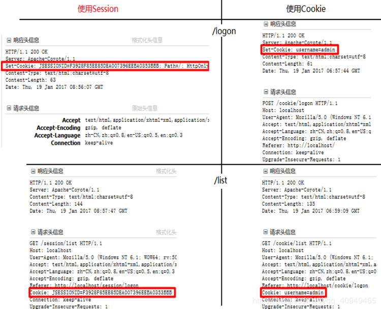

64. jsp 和 servlet 有什么区别？

    servlet：是一类，一个接口还是动态网页的规范，规范了项目结构。用于服务端和浏览器进行动态交互，生成动态网页

    jsp：java server pages,动态网页技术

    答案：

    1. jsp经编译后就变成了Servlet.（JSP的本质就是Servlet，JVM只能识别java的类，不能识别JSP的代码，Web容器将JSP的代码编译成JVM能够识别的java类）

    2. jsp更擅长表现于页面显示，servlet更擅长于逻辑控制。

    3. Servlet中没有内置对象，Jsp中的内置对象都是必须通过HttpServletRequest对象，HttpServletResponse对象以及HttpServlet对象得到。

    4. Jsp是Servlet的一种简化，使用Jsp只需要完成程序员需要输出到客户端的内容，Jsp中的Java脚本如何镶嵌到一个类中，由Jsp容器完成。而Servlet则是个完整的Java类，这个类的Service方法用于生成对客户端的响应。

65. jsp 有哪些内置对象？作用分别是什么？

    JSP中的9大内置对象:

    ------------------------------------------------------------------------------------------------------------------

           对象名称                                 对象类型                                    描述

            request                                HttpServletRequest                   请求对象

            response                             HttpServletResponse                 响应对象

            session                                   HttpSession                             当前的会话域对象

            application                           ServletContext                         当前正在运行的web项目

            config                                    ServletConfig                            当前Servlet的配置对象

            pageContext                         PageContext                            当前JSP页面的域对象

            page                                         Object                                     当前JSP对象

            exception                                 Throwable                              异常对象

            out                                           JspWriter                                 JSP的字符输出流

    答案：

    JSP有9个内置对象：

    * request：封装客户端的请求，其中包含来自GET或POST请求的参数；

    * response：封装服务器对客户端的响应；

    * pageContext：通过该对象可以获取其他对象；

    * session：封装用户会话的对象；

    * application：封装服务器运行环境的对象；

    * out：输出服务器响应的输出流对象；

    * config：Web应用的配置对象；

    * page：JSP页面本身（相当于Java程序中的this）；

    * exception：封装页面抛出异常的对象。

66. 说一下 jsp 的 4 种作用域？

    作用域对象名称         作用域对象的类型                       描述

    pageContext(page)       PageContext                            当前JSP的作用域对象

    request                      HttpServletRequest                     当前请求的作用域

    session                             HttpSession                            当前会话的作用域

    application                    ServletContext                         当前Web应用的作用域

    答案：

    JSP中的四种作用域包括page、request、session和application，具体来说：

    * page代表与一个页面相关的对象和属性。

    * request代表与Web客户机发出的一个请求相关的对象和属性。一个请求可能跨越多个页面，涉及多个Web组件；需要在页面显示的临时数据可以置于此作用域。

    * session代表与某个用户与服务器建立的一次会话相关的对象和属性。跟某个用户相关的数据应该放在用户自己的session中。

    * application代表与整个Web应用程序相关的对象和属性，它实质上是跨越整个Web应用程序，包括多个页面、请求和会话的一个全局作用域。


67. session 和 cookie 有什么区别？

    session：是服务端技术，基于cookie实现的。每一个用户都会在服务端创建一个session，然后生成JSEESIONID以cookie形式返回给浏览器

    cookie：是客户端技术，服务端把每个用户的数据以cookie形式返回给浏览器，当用户再次访问就带着cookie来访问

    答案：

    由于HTTP协议是无状态的协议，所以服务端需要记录用户的状态时，就需要用某种机制来识具体的用户，这个机制就是Session.典型的场景比如购物车，当你点击下单按钮时，由于HTTP协议无状态，所以并不知道是哪个用户操作的，所以服务端要为特定的用户创建了特定的Session，用用于标识这个用户，并且跟踪用户，这样才知道购物车里面有几本书。这个Session是保存在服务端的，有一个唯一标识。在服务端保存Session的方法很多，内存、数据库、文件都有。集群的时候也要考虑Session的转移，在大型的网站，一般会有专门的Session服务器集群，用来保存用户会话，这个时候 Session 信息都是放在内存的，使用一些缓存服务比如Memcached之类的来放 Session。

    思考一下服务端如何识别特定的客户？这个时候Cookie就登场了。每次HTTP请求的时候，客户端都会发送相应的Cookie信息到服务端。实际上大多数的应用都是用 Cookie 来实现Session跟踪的，第一次创建Session的时候，服务端会在HTTP协议中告诉客户端，需要在 Cookie 里面记录一个Session ID，以后每次请求把这个会话ID发送到服务器，我就知道你是谁了。有人问，如果客户端的浏览器禁用了 Cookie 怎么办？一般这种情况下，会使用一种叫做URL重写的技术来进行会话跟踪，即每次HTTP交互，URL后面都会被附加上一个诸如 sid=xxxxx 这样的参数，服务端据此来识别用户。

    Cookie其实还可以用在一些方便用户的场景下，设想你某次登陆过一个网站，下次登录的时候不想再次输入账号了，怎么办？这个信息可以写到Cookie里面，访问网站的时候，网站页面的脚本可以读取这个信息，就自动帮你把用户名给填了，能够方便一下用户。这也是Cookie名称的由来，给用户的一点甜头。所以，总结一下：Session是在服务端保存的一个数据结构，用来跟踪用户的状态，这个数据可以保存在集群、数据库、文件中；Cookie是客户端保存用户信息的一种机制，用来记录用户的一些信息，也是实现Session的一种方式。

 

68. 说一下 session 的工作原理？

    获取用户传输到服务端的数据封装称session对象，然后生成JSESSIONID以cookie的形式返回给浏览器，就是图中Set-Cookie

    

    答案:

    其实session是一个存在服务器上的类似于一个散列表格的文件。里面存有我们需要的信息，在我们需要用的时候可以从里面取出来。类似于一个大号的map吧，里面的键存储的是用户的sessionid，用户向服务器发送请求的时候会带上这个sessionid。这时就可以从中取出对应的值了。

69. 如果客户端禁止 cookie 能实现 session 还能用吗？

    不能，session是基于cookie实现的

    答案：

    Cookie与 Session，一般认为是两个独立的东西，Session采用的是在服务器端保持状态的方案，而Cookie采用的是在客户端保持状态的方案。但为什么禁用Cookie就不能得到Session呢？因为Session是用Session ID来确定当前对话所对应的服务器Session，而Session ID是通过Cookie来传递的，禁用Cookie相当于失去了Session ID，也就得不到Session了。

    假定用户关闭Cookie的情况下使用Session，其实现途径有以下几种：

    1. 设置php.ini配置文件中的“session.use_trans_sid = 1”，或者编译时打开打开了“--enable-trans-sid”选项，让PHP自动跨页传递Session ID。

    2. 手动通过URL传值、隐藏表单传递Session ID。

    3. 用文件、数据库等形式保存Session ID，在跨页过程中手动调用。

70. spring mvc 和 struts 的区别是什么？

    * 拦截机制的不同
    
        Struts2是类级别的拦截，每次请求就会创建一个Action，和Spring整合时Struts2的ActionBean注入作用域是原型模式prototype，然后通过setter，getter吧request数据注入到属性。Struts2中，一个Action对应一个request，response上下文，在接收参数时，可以通过属性接收，这说明属性参数是让多个方法共享的。Struts2中Action的一个方法可以对应一个url，而其类属性却被所有方法共享，这也就无法用注解或其他方式标识其所属方法了，只能设计为多例。

        SpringMVC是方法级别的拦截，一个方法对应一个Request上下文，所以方法直接基本上是独立的，独享request，response数据。而每个方法同时又何一个url对应，参数的传递是直接注入到方法中的，是方法所独有的。处理结果通过ModeMap返回给框架。在Spring整合时，SpringMVC的Controller Bean默认单例模式Singleton，所以默认对所有的请求，只会创建一个Controller，有应为没有共享的属性，所以是线程安全的，如果要改变默认的作用域，需要添加@Scope注解修改。

        Struts2有自己的拦截Interceptor机制，SpringMVC这是用的是独立的Aop方式，这样导致Struts2的配置文件量还是比SpringMVC大。

    * 底层框架的不同　

        Struts2采用Filter（StrutsPrepareAndExecuteFilter）实现，SpringMVC（DispatcherServlet）则采用Servlet实现。Filter在容器启动之后即初始化；服务停止以后坠毁，晚于Servlet。Servlet在是在调用时初始化，先于Filter调用，服务停止后销毁

    * 性能方面

        Struts2是类级别的拦截，每次请求对应实例一个新的Action，需要加载所有的属性值注入，SpringMVC实现了零配置，由于SpringMVC基于方法的拦截，有加载一次单例模式bean注入。所以，SpringMVC开发效率和性能高于Struts2。

    * 配置方面

        spring MVC和Spring是无缝的。从这个项目的管理和安全上也比Struts2高。

71. 如何避免 sql 注入？

    * PreparedStatement（简单又有效的方法）

    * 使用正则表达式过滤传入的参数

    * 字符串过滤

    * JSP中调用该函数检查是否包函非法字符

    * JSP页面判断代码

72. 什么是 XSS 攻击，如何避免？

    XSS攻击又称CSS,全称Cross Site Script  （跨站脚本攻击），其原理是攻击者向有XSS漏洞的网站中输入恶意的 HTML 代码，当用户浏览该网站时，这段 HTML 代码会自动执行，从而达到攻击的目的。XSS 攻击类似于 SQL 注入攻击，SQL注入攻击中以SQL语句作为用户输入，从而达到查询/修改/删除数据的目的，而在xss攻击中，通过插入恶意脚本，实现对用户游览器的控制，获取用户的一些信息。 XSS是 Web 程序中常见的漏洞，XSS 属于被动式且用于客户端的攻击方式。

    XSS防范的总体思路是：对输入(和URL参数)进行过滤，对输出进行编码。

73. 什么是 CSRF 攻击，如何避免？

    CSRF（Cross-site request forgery）也被称为 one-click attack或者 session riding，中文全称是叫跨站请求伪造。一般来说，攻击者通过伪造用户的浏览器的请求，向访问一个用户自己曾经认证访问过的网站发送出去，使目标网站接收并误以为是用户的真实操作而去执行命令。常用于盗取账号、转账、发送虚假消息等。攻击者利用网站对请求的验证漏洞而实现这样的攻击行为，网站能够确认请求来源于用户的浏览器，却不能验证请求是否源于用户的真实意愿下的操作行为。

    如何避免：
    
    1. 验证 HTTP Referer 字段

        HTTP头中的Referer字段记录了该 HTTP 请求的来源地址。在通常情况下，访问一个安全受限页面的请求来自于同一个网站，而如果黑客要对其实施 CSRF
        攻击，他一般只能在他自己的网站构造请求。因此，可以通过验证Referer值来防御CSRF 攻击。

    2. 使用验证码

        关键操作页面加上验证码，后台收到请求后通过判断验证码可以防御CSRF。但这种方法对用户不太友好。

    3. 在请求地址中添加token并验证
        
        CSRF 攻击之所以能够成功，是因为黑客可以完全伪造用户的请求，该请求中所有的用户验证信息都是存在于cookie中，因此黑客可以在不知道这些验证信息的情况下直接利用用户自己的cookie 来通过安全验证。要抵御 CSRF，关键在于在请求中放入黑客所不能伪造的信息，并且该信息不存在于 cookie 之中。可以在 HTTP 请求中以参数的形式加入一个随机产生的 token，并在服务器端建立一个拦截器来验证这个 token，如果请求中没有token或者 token 内容不正确，则认为可能是 CSRF 攻击而拒绝该请求。这种方法要比检查 Referer 要安全一些，token 可以在用户登陆后产生并放于session之中，然后在每次请求时把token 从 session 中拿出，与请求中的 token 进行比对，但这种方法的难点在于如何把 token 以参数的形式加入请求。
        对于 GET 请求，token 将附在请求地址之后，这样 URL 就变成 http://url?csrftoken=tokenvalue。
        而对于 POST 请求来说，要在 form 的最后加上 <input type="hidden" name="csrftoken" value="tokenvalue"/>，这样就把token以参数的形式加入请求了。

    4. 在HTTP 头中自定义属性并验证

        这种方法也是使用 token 并进行验证，和上一种方法不同的是，这里并不是把 token 以参数的形式置于 HTTP 请求之中，而是把它放到 HTTP 头中自定义的属性里。通过 XMLHttpRequest 这个类，可以一次性给所有该类请求加上 csrftoken 这个 HTTP 头属性，并把 token 值放入其中。这样解决了上种方法在请求中加入 token 的不便，同时，通过 XMLHttpRequest 请求的地址不会被记录到浏览器的地址栏，也不用担心 token 会透过 Referer 泄露到其他网站中去。


74. throw 和 throws 的区别？

    throw：是手动抛出异常，只能抛出一个异常

    throws：是用于方法上来抛出异常，表示不处理当前异常

    答案：

    throws是用来声明一个方法可能抛出的所有异常信息，throws是将异常声明但是不处理，而是将异常往上传，谁调用我就交给谁处理。而throw则是指抛出的一个具体的异常类型。

 
75. final、finally、finalize 有什么区别？

    毛关系都没有

    答案：

    * final可以修饰类、变量、方法，修饰类表示该类不能被继承、修饰方法表示该方法不能被重写、修饰变量表示该变量是一个常量不能被重新赋值。

    * finally一般作用在try-catch代码块中，在处理异常的时候，通常我们将一定要执行的代码方法finally代码块中，表示不管是否出现异常，该代码块都会执行，一般用来存放一些关闭资源的代码。

    * finalize是一个方法，属于Object类的一个方法，而Object类是所有类的父类，该方法一般由垃圾回收器来调用，当我们调用System的gc()方法的时候，由垃圾回收器调用finalize(),回收垃圾。 

76. try-catch-finally 中哪个部分可以省略？

    catch

    答案：

    catch 可以省略

    原因：

    更为严格的说法其实是：try只适合处理运行时异常，try+catch适合处理运行时异常+普通异常。也就是说，如果你只用try去处理普通异常却不加以catch处理，编译是通不过的，因为编译器硬性规定，普通异常如果选择捕获，则必须用catch显示声明以便进一步处理。而运行时异常在编译时没有如此规定，所以catch可以省略，你加上catch编译器也觉得无可厚非。

    理论上，编译器看任何代码都不顺眼，都觉得可能有潜在的问题，所以你即使对所有代码加上try，代码在运行期时也只不过是在正常运行的基础上加一层皮。但是你一旦对一段代码加上try，就等于显示地承诺编译器，对这段代码可能抛出的异常进行捕获而非向上抛出处理。如果是普通异常，编译器要求必须用catch捕获以便进一步处理；如果运行时异常，捕获然后丢弃并且+finally扫尾处理，或者加上catch捕获以便进一步处理。
     
    至于加上finally，则是在不管有没捕获异常，都要进行的“扫尾”处理。

77. try-catch-finally 中，如果 catch 中 return 了，finally 还会执行吗？

    会执行。

    答案：

    会执行，在 return 前执行。

    代码示例1：

    ```java
    /*
    * java面试题--如果catch里面有return语句，finally里面的代码还会执行吗？
    */
    public class FinallyDemo2 {
        public static void main(String[] args) {
            System.out.println(getInt());
        }
    
        public static int getInt() {
            int a = 10;
            try {
                System.out.println(a / 0);
                a = 20;
            } catch (ArithmeticException e) {
                a = 30;
                return a;
                /*
                * return a 在程序执行到这一步的时候，这里不是return a 而是 return 30；这个返回路径就形成了
                * 但是呢，它发现后面还有finally，所以继续执行finally的内容，a=40
                * 再次回到以前的路径,继续走return 30，形成返回路径之后，这里的a就不是a变量了，而是常量30
                */
            } finally {
                a = 40;
            }
    
    //      return a;
        }
    }
    ```

    执行结果：30

    代码示例2：

    ```java
    package com.java_02;
    
    /*
    * java面试题--如果catch里面有return语句，finally里面的代码还会执行吗？
    */
    public class FinallyDemo2 {
        public static void main(String[] args) {
            System.out.println(getInt());
        }
    
        public static int getInt() {
            int a = 10;
            try {
                System.out.println(a / 0);
                a = 20;
            } catch (ArithmeticException e) {
                a = 30;
                return a;
                /*
                * return a 在程序执行到这一步的时候，这里不是return a 而是 return 30；这个返回路径就形成了
                * 但是呢，它发现后面还有finally，所以继续执行finally的内容，a=40
                * 再次回到以前的路径,继续走return 30，形成返回路径之后，这里的a就不是a变量了，而是常量30
                */
            } finally {
                a = 40;
                return a; //如果这样，就又重新形成了一条返回路径，由于只能通过1个return返回，所以这里直接返回40
            }
    
    //      return a;
        }
    }
    ```
    执行结果：40

 

78. 常见的异常类有哪些？

    分为免检异常、必检异常

    常见的免检异常，主要是RunTimeException下面的

              ArithmeticException:算术异常

              NullPointerException:空指针异常

              ArrayIndexOutOfBoundsException:数组索引越界

              StringIndexOutOfBoundsException:String操作中索引越界

             NumberFormatException:数字格式化异常

              ClassCastException:类型强制转换异常

    答案：

    * NullPointerException：当应用程序试图访问空对象时，则抛出该异常。

    * SQLException：提供关于数据库访问错误或其他错误信息的异常。

    * IndexOutOfBoundsException：指示某排序索引（例如对数组、字符串或向量的排序）超出范围时抛出。 

    * NumberFormatException：当应用程序试图将字符串转换成一种数值类型，但该字符串不能转换为适当格式时，抛出该异常。

    * FileNotFoundException：当试图打开指定路径名表示的文件失败时，抛出此异常。

    * IOException：当发生某种I/O异常时，抛出此异常。此类是失败或中断的I/O操作生成的异常的通用类。

    * ClassCastException：当试图将对象强制转换为不是实例的子类时，抛出该异常。

    * ArrayStoreException：试图将错误类型的对象存储到一个对象数组时抛出的异常。

    * IllegalArgumentException：抛出的异常表明向方法传递了一个不合法或不正确的参数。

    * ArithmeticException：当出现异常的运算条件时，抛出此异常。例如，一个整数“除以零”时，抛出此类的一个实例。 

    * NegativeArraySizeException：如果应用程序试图创建大小为负的数组，则抛出该异常。

    * NoSuchMethodException：无法找到某一特定方法时，抛出该异常。

    * SecurityException：由安全管理器抛出的异常，指示存在安全侵犯。

    * UnsupportedOperationException：当不支持请求的操作时，抛出该异常。
    
    * RuntimeExceptionRuntimeException：是那些可能在Java虚拟机正常运行期间抛出的异常的超类。


原文：https://blog.csdn.net/qq_40949465/java/article/details/88766411