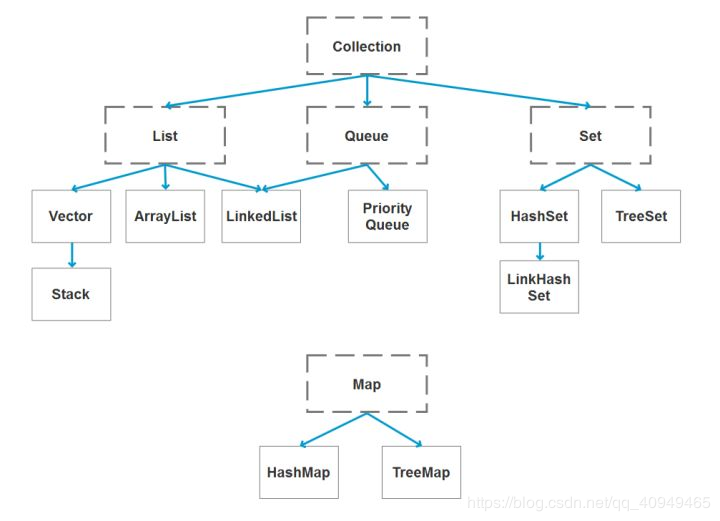

18. java 容器都有哪些？

    
    List、Set、Map容器

    答案：
    

19. Collection 和 Collections 有什么区别？

    Collection ：是一个集合接口，下面有set、list接口

    Collections：封装了list、set、map操作的工具方法

    答案：

    java.util.Collection 是一个集合接口（集合类的一个顶级接口）。它提供了对集合对象进行基本操作的通用接口方法。Collection接口在Java 类库中有很多具体的实现。Collection接口的意义是为各种具体的集合提供了最大化的统一操作方式，其直接继承接口有List与Set。

    Collections则是集合类的一个工具类/帮助类，其中提供了一系列静态方法，用于对集合中元素进行排序、搜索以及线程安全等各种操作。

20. List、Set、Map 之间的区别是什么？

    list、set继承了collection接口而map（是键值对）没有

    答案：
    

21. HashMap 和 Hashtable 有什么区别？

    Hashtable是HashMap的前身，所有方法都加了synchronized,是线程安全的，但是性能不高

    synchronized实现原理是靠管程（Monitor）对象

    答案：

    hashMap去掉了HashTable 的contains方法，但是加上了containsValue（）和containsKey（）方法。

    hashTable同步的，而HashMap是非同步的，效率上逼hashTable要高。

    hashMap允许空键值，而hashTable不允许。

22. 如何决定使用 HashMap 还是 TreeMap？

    答案:

    对于在Map中插入、删除和定位元素这类操作，HashMap是最好的选择。然而，假如你需要对一个有序的key集合进行遍历，TreeMap是更好的选择。基于你的collection的大小，也许向HashMap中添加元素会更快，将map换为TreeMap进行有序key的遍历。

23. 说一下 HashMap 的实现原理？

    HashMap是结合了数组和链表的优势互补，底层用了hash算法，当我们put一个元素，首先会进行hash运算，得到一个哈希值h,在执行h^(h>>>16)让高16位和低16位进行异或运算，增加hash值的随机性，减少碰撞（原因：有这样一类hash值，低位全是0，高位才有变化，这样容易产生冲突），然后在：   (数组长度 - 1) & hash   得到数组下标。如果 发生碰撞就采用链表法，如果链表超出了长度8，就变为红黑树了

    答案：

    HashMap概述： HashMap是基于哈希表的Map接口的非同步实现。此实现提供所有可选的映射操作，并允许使用null值和null键。此类不保证映射的顺序，特别是它不保证该顺序恒久不变。 

    HashMap的数据结构： 在java编程语言中，最基本的结构就是两种，一个是数组，另外一个是模拟指针（引用），所有的数据结构都可以用这两个基本结构来构造的，HashMap也不例外。HashMap实际上是一个“链表散列”的数据结构，即数组和链表的结合体。

    当我们往Hashmap中put元素时,首先根据key的hashcode重新计算hash值,根绝hash值得到这个元素在数组中的位置(下标),如果该数组在该位置上已经存放了其他元素,那么在这个位置上的元素将以链表的形式存放,新加入的放在链头,最先加入的放入链尾.如果数组中该位置没有元素,就直接将该元素放到数组的该位置上。

    需要注意Jdk 1.8中对HashMap的实现做了优化,当链表中的节点数据超过八个之后,该链表会转为红黑树来提高查询效率,从原来的O(n)到O(logn)

24. 说一下 HashSet 的实现原理？

    通过阅读源代码发现,相同算法的Set底层用的是相同算法（Hash算法）的Map.

    把Set的集合对象作为Map的key,再使用一个Object常量最为value.

     答案：

    HashSet底层由HashMap实现

    HashSet的值存放于HashMap的key上

    HashMap的value统一为PRESENT

25. ArrayList 和 LinkedList 的区别是什么？

    ArrayList实现原理是数组，是一块连续的内存地址，根据下标随机访问时间复杂度为O(1)，适合查找

    LinkedList实现原理是链表，是通过指针将一组零散的内存块串联在一起，随机访问时间复杂度为O(n)，适合插入删除

    答案：

    最明显的区别是 ArrrayList底层的数据结构是数组，支持随机访问，而 LinkedList 的底层数据结构是双向循环链表，不支持随机访问。使用下标访问一个元素，ArrayList 的时间复杂度是 O(1)，而 LinkedList 是 O(n)。

26. 如何实现数组和 List 之间的转换？

    Arrays.asList()

    答案：

    List转换成为数组：调用ArrayList的toArray方法。

    数组转换成为List：调用Arrays的asList方法。

27. ArrayList 和 Vector 的区别是什么？

    1、创建对象时，如果没指定初始化容量时，ArrayList时在第一次添加时，初始化容量(DEFAULT_CAPACITY)为10

    而Vector是在创建对象时就初始化容量为10

    2、ArrayList 扩容为1.5倍，Vector 为2倍（如果在构造方法中指定扩增容量，就扩容原来容量+增长容量）

    3、ArrayList 线程安全，Vector所有方法都加了synchronized，线程安全

    答案：

    Vector是同步的，而ArrayList不是。然而，如果你寻求在迭代的时候对列表进行改变，你应该使用CopyOnWriteArrayList。

    ArrayList比Vector快，它因为有同步，不会过载。

    ArrayList更加通用，因为我们可以使用Collections工具类轻易地获取同步列表和只读列表。

28. Array 和 ArrayList 有何区别？

    java.lang.reflect.Array类提供静态方法来动态创建和访问Java数组，

    答案：

    Array可以容纳基本类型和对象，而ArrayList只能容纳对象。

    Array是指定大小的，而ArrayList大小是固定的。

    Array没有提供ArrayList那么多功能，比如addAll、removeAll和iterator等

29. 在 Queue 中 poll()和 remove()有什么区别？

    答案：

    poll() 和 remove() 都是从队列中取出一个元素，但是 poll() 在获取元素失败的时候会返回空，但是 remove() 失败的时候会抛出异常。

30. 哪些集合类是线程安全的？

    Vector 、HashTable

    答案：

    vector：就比arraylist多了个同步化机制（线程安全），因为效率较低，现在已经不太建议使用。在web应用中，特别是前台页面，往往效率（页面响应速度）是优先考虑的。

    statck：堆栈类，先进后出。

    hashtable：就比hashmap多了个线程安全。

    enumeration：枚举，相当于迭代器。

31. 迭代器 Iterator 是什么？

    是一个接口，在ArrayList有个内部类实现了该接口，用于遍历集合，有hashNext（）、next（）、remove方法

    如果在遍历的同时，使用集合提供的remote方法就会抛出并发修改异常，因为每次迭代都会检查modCount是否等于

    expectedModCount，因此建议使用迭代器里的remote方法来删除

    答案：

    迭代器是一种设计模式，它是一个对象，它可以遍历并选择序列中的对象，而开发人员不需要了解该序列的底层结构。迭代器通常被称为“轻量级”对象，因为创建它的代价小。

32. Iterator 怎么使用？有什么特点？

    答案：

    Java中的Iterator功能比较简单，并且只能单向移动：

    (1) 使用方法iterator()要求容器返回一个Iterator。第一次调用Iterator的next()方法时，它返回序列的第一个元素。注意：iterator()方法是java.lang.Iterable接口,被Collection继承。

    (2) 使用next()获得序列中的下一个元素。

    (3) 使用hasNext()检查序列中是否还有元素。

    (4) 使用remove()将迭代器新返回的元素删除。

    Iterator是Java迭代器最简单的实现，为List设计的ListIterator具有更多的功能，它可以从两个方向遍历List，也可以从List中插入和删除元素。

33. Iterator 和 ListIterator 有什么区别？

    在集合ArrayList和LinkedList都有内部类实现了ListIterator接口，用于双向迭代

    答案：

    Iterator可用来遍历Set和List集合，但是ListIterator只能用来遍历List。

    Iterator对集合只能是前向遍历，ListIterator既可以前向也可以后向。

    ListIterator实现了Iterator接口，并包含其他的功能，比如：增加元素，替换元素，获取前一个和后一个元素的索引，等等

34. 怎么确保一个集合不能被修改？

    Collections.unmodifiableList(List)
    Collections.unmodifiableMap(Map)
    Collections.unmodifiableSet(Set)

    以上返回的集合对象都是不可修改的，调用修改方法会抛出异常UnsupportedOperationException

原文：https://blog.csdn.net/qq_40949465/java/article/details/88752978