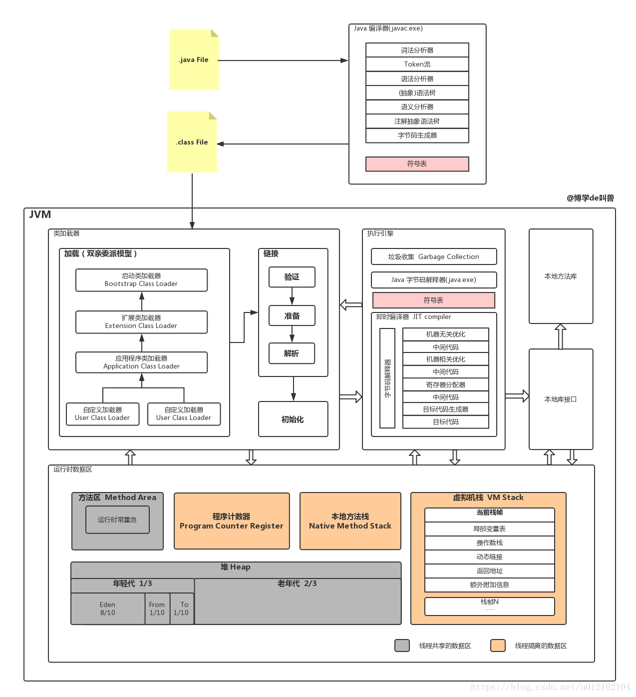
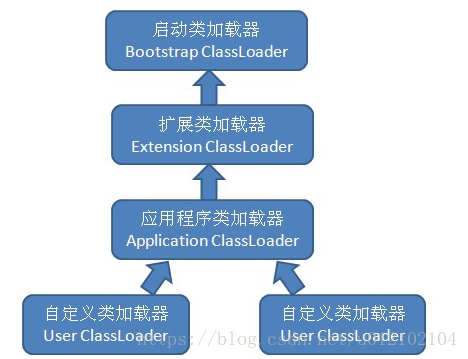
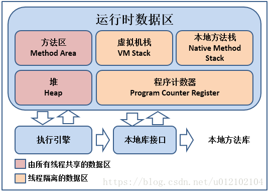
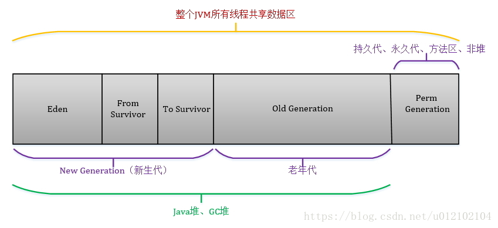

## Java JVM

1. JVM结构图

    

2. 类加载机制

    类加载的五个过程

    1. 加载：类加载器获二进制字节流，将静态存储结构转化为方法区的运行时数据结构，并生成此类的Class对象。

    2. 验证：验证文件格式、元数据、字节码、符号引用，确保Class的字节流中包含的信息符合当前虚拟机的要求。

    3. 准备：为类变量分配内存并设置其初始值，这些变量使用的内存都将在方法区中进行分配。

    4. 解析：将常量池内的符号引用替换为直接引用，包括类或接口的解析、字段解析、类方法解析、接口方法解析。

    5. 初始化：执行类中定义的Java程序代码（字节码）。

    类的生命周期(7个)：加载、验证、准备、解析、初始化、使用、卸载

3. Java类加载器及如何加载类
  
    类加载器是实现通过一个类的全限定名来获取描述此类的二进制文件流的代码模块。类的加载是通过双亲委派模型来完成的，双亲委派模型即为下图所示的类加载器之间的层次关系。

    双亲委派模型的工作过程是：如果一个类加载器接收到类加载的请求，它会先把这个请求委派给父加载器去完成，只有当父加载器反馈自己无法完成加载请求时，子加载器才会尝试自己去加载。可以得知，所有的加载请求最终都会传送到启动类加载器中。

    

    使用双亲委派模型组织类加载器之间的关系有一个显而易见的好处：Java类随着它的类加载器一起具备了某种带优先级的层次关系。如果没有使用双亲委派模型，而是由各类加载器自行加载，假如用户自己编写一个Object类放在ClassPath中，那么系统将会出现多个不同的Object类，Java体系中最基础的行为也就无法保证，应用程序将变得一片混乱。

4. 内存分配

    JVM内存结构

    * Java堆：Java虚拟机所管理的内存中最大的一块，唯一的目的是存放对象实例。由于是垃圾收集器管理的主要区域，因此有时候也被称作GC堆。

    * 方法区：用于存储已被虚拟机加载的类信息、常量、静态变量、及时编译器编译后的代码等数据。

    * 程序计数器：当前线程所执行字节码的行号指示器。每一个线程都有一个独立的程序计数器，线程的阻塞、恢复、挂起等一系列操作都需要程序计数器的参与，因此必须是线程私有的。

    * Java虚拟机栈：用于描述Java方法执行的模型。每个方法在执行的同时都会创建一个栈帧，用于存储局部变量表、操作数栈、动态链接、方法出口等信息。每一个方法从调用至执行完成，对应于一个栈帧在虚拟机栈中从入栈到出栈。

    * 本地方法栈：与虚拟机栈作用相似，只不过虚拟机栈为执行Java方法服务，而本地方法栈为执行Native方法服务，比如在Java中调用C/C++。

    

5. JVM内存分代机制，各代特点，分代回收优点

    * 新生代（Young）：HotSpot将新生代划分为三块，一块较大的Eden空间和两块较小的Survivor空间，默认比例为8：1：1。

    * 老年代（Old）：在新生代中经历了多次GC后仍然存活下来的对象会进入老年代中。老年代中的对象生命周期较长，存活率比较高，在老年代中进行GC的频率相对而言较低，而且回收的速度也比较慢。

    * 永久代（Permanent）：永久代存储类信息、常量、静态变量、即时编译器编译后的代码等数据，对这一区域而言，一般而言不会进行垃圾回收。

    新版已经删除永久代。

    

    新生成的对象在Eden区分配（大对象除外，大对象直接进入老年代），当Eden区没有足够的空间进行分配时，虚拟机将发起一次Minor GC。GC开始时，对象只会存在于Eden区和From Survivor区，To Survivor区是空的（作为保留区域）。GC进行时，Eden区中所有存活的对象都会被复制到To Survivor区，而在From Survivor区中，仍存活的对象会根据它们的年龄值决定去向，年龄值达到年龄阀值（默认为15，新生代中的对象每熬过一轮垃圾回收，年龄值就加1，GC分代年龄存储在对象的Header中）的对象会被移到老年代中，没有达到阀值的对象会被复制到To Survivor区。接着清空Eden区和From Survivor区，新生代中存活的对象都在To Survivor区。接着， From Survivor区和To Survivor区会交换它们的角色，也就是新的To Survivor区就是上次GC清空的From Survivor区，新的From Survivor区就是上次GC的To Survivor区，总之，不管怎样都会保证To Survivor区在一轮GC后是空的。GC时当To Survivor区没有足够的空间存放上一次新生代收集下来的存活对象时，需要依赖老年代进行分配担保，将这些对象存放在老年代中。

6. 常用的内存调试工具

    * JConsole（可视化工具，可排查死锁、生成Heap Dump文件等）
    * Jmap
    * jstack

7. 垃圾回收

    垃圾回收需要完成的三件事：

    1. 哪些内存需要回收？

        堆

    2. 什么时候回收？

        * 引用计数算法：给对象添加一个引用计数器，每当有一个地方引用它时，计数器加1，每当一个引用失效时，计数器减1，任何时刻计数器为0则代表对象不被引用。

        注意：引用计数算法有一个比较大的问题，那就是它不能处理环形数据。即如果有两个对象相互引用，那么这两个对象计数器始终不为0，也就不能被回收。

        * 可达性分析算法：设立若干根对象（GC Roots），每个对象都是一个子节点。从根向下搜索所走过的路径叫引用链，当一个对象到根无任何引用链相连，证明此对象不可用。

            Java语言中可以作为GC Roots的对象包括以下几种：

            1. 虚拟机栈中引用的对象
            2. 方法区中类静态属性引用的对象
            3. 方法区中常量引用的对象
            4. 本地方法栈中JNI引用的对象

    3. 如何回收？

        1. 标记-清除算法：先标记出所有需要回收的对象，标记完成后统一回收所有被标记的对象。
        2. 复制算法：将可用内存分为大小相等的两块，每次只使用其中一块，当这一块内存用完了，就将存活的对象复制到另一块，最后将此块内存一次性清理掉。
        3. 标记-整理算法：先标记所有需要回收的对象，然后让所有存活的对象向一端移动，最后直接清理掉边界以外的另一端内存。
        4. 分代收集算法：把Java堆分为新生代和老年代。新生代中只有少量对象会存活，就选用复制算法；老年代中对象存活率较高，选用标记-XX算法。

8. 垃圾收集器有哪些

    * Serial收集器：单线程收集器。收集垃圾时必须暂停其他所有工作线程，直到它收集结束。
    * Parnew收集器：Serial收集器多线程版本。
    * Parallel Scavenge收集器：使用复制算法的新生代收集器。
    * Serial Old收集器：使用标记-整理算法的老年代单线程收集器。
    * Parallel Old收集器：使用标记-整理算法的老年代多线程收集器。
    * CMS收集器：基于标记-清除算法的低停顿并发收集器。运作步骤为①初始标记②并发标记③重新标记④并发清除。
    * G1收集器：最前沿的面向服务端应用的垃圾收集器。运作步骤为①初始标记②并发标记③最终标记④筛选回收。G1收集器有以下特点
        * 并行与并发：无需停顿Java线程来执行GC动作。
        * 分代收集：可独立管理整个GC堆。
        * 空间整合：运行期间不会产生内存空间碎片。
        * 可预测的停顿：除了低停顿，还能建立可预测的停顿时间模型。

9. Minor GC与Full GC

    * 新生代 GC（Minor GC）：指发生在新生代的垃圾收集动作，因为 Java 对象大多都具备朝生夕灭的特性，所以 Minor GC 非常频繁，一般回收速度也比较快。
    * 老年代 GC（Major GC / Full GC）：指发生在老年代的垃圾收集动作，出现了 Major GC，经常会伴随至少一次 Minor GC（非绝对），MajorGC 的速度一般会比 Minor GC 慢10倍以上。

    Minor GC与Full GC触发条件：

    * Minor GC触发条件：
        * 当Eden区没有足够的空间进行分配时
        * 老年代最大可用连续空间大于Minor GC历次晋升到老年代对象的平均大小
    * Full GC触发条件：
        * 调用System.gc()时（系统建议执行Full GC，但是不必然执行）
        * 老年代空间不足时
        * 方法区空间不足时
        * 老年代最大可用连续空间小于Minor GC历次晋升到老年代对象的平均大小
        * CMS GC在垃圾回收的时候，当对象从Eden区进入Survivor区，Survivor区空间不足需要放入老年代，而老年代空间也不足时

原文：https://blog.csdn.net/u012102104/article/details/79773328