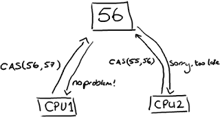

## Java-多线程

1. 什么是线程？

    线程是操作系统能够进行运算调度的最小单位，它被包含在进程之中，是进程中的实际运作单位。程序员可以通过它进行多处理器编程，你可以使用多线程对运算密集型任务提速。比如，如果一个线程完成一个任务要100毫秒，那么用十个线程完成改任务只需10毫秒。Java在语言层面对多线程提供了卓越的支持，它也是一个很好的卖点。

2. 线程和进程有什么区别？

    线程是进程的子集，一个进程可以有很多线程，每条线程并行执行不同的任务。不同的进程使用不同的内存空间，而所有的线程共享一片相同的内存空间。别把它和栈内存搞混，每个线程都拥有单独的栈内存用来存储本地数据。

3. 如何在Java中实现线程？

    1. java.lang.Thread 类的实例就是一个线程但是它需要调用java.lang.Runnable接口来执行，

    2. 由于线程类本身就是调用的Runnable接口所以你可以继承java.lang.Thread 类或者直接调用Runnable接口来重写run()方法实现线程。

    3. 实现Callable接口通过FutureTask包装器来创建Thread线程

        Callable接口（也只有一个方法）定义如下：

        ```java
        public interface Callable<V>   {
            V call（） throws Exception;
        }
        ```

        ```java
        public class SomeCallable<V> extends OtherClass implements Callable<V> {

            @Override
            public V call()throws Exception {
                // TODO Auto-generated method stub
                return null;
            }

        }
        ```

        ```java
        Callable<V> oneCallable = new SomeCallable<V>();   
        //由Callable<Integer>创建一个FutureTask<Integer>对象：   
        FutureTask<V> oneTask = new FutureTask<V>(oneCallable);   
        //注释：FutureTask<Integer>是一个包装器，它通过接受Callable<Integer>来创建，它同时实现了Future和Runnable接口。 
        //由FutureTask<Integer>创建一个Thread对象：   
        Thread oneThread = new Thread(oneTask);   
        oneThread.start();   
        //至此，一个线程就创建完成了。
        ```

4. 使用ExecutorService、Callable、Future实现有返回结果的线程

    ExecutorService、Callable、Future三个接口实际上都是属于Executor框架。返回结果的线程是在JDK1.5中引入的新特征，有了这种特征就不需要再为了得到返回值而大费周折了。而且自己实现了也可能漏洞百出。

    可返回值的任务必须实现Callable接口。类似的，无返回值的任务必须实现Runnable接口。

    执行Callable任务后，可以获取一个Future的对象，在该对象上调用get就可以获取到Callable任务返回的Object了。

    注意：get方法是阻塞的，即：线程无返回结果，get方法会一直等待。

    再结合线程池接口ExecutorService就可以实现传说中有返回结果的多线程了。

5. Thread 类中的start()和 run()方法有什么区别

    1. start（）方法来启动线程，真正实现了多线程运行。这时无需等待run方法体代码执行完毕，可以直接继续执行下面的代码；通过调用Thread类的start()方法来启动一个线程， 这时此线程是处于就绪状态， 并没有运行。 然后通过此Thread类调用方法run()来完成其运行操作的， 这里方法run()称为线程体，它包含了要执行的这个线程的内容， Run方法运行结束， 此线程终止。然后CPU再调度其它线程。

    2. run（）方法当作普通方法的方式调用。程序还是要顺序执行，要等待run方法体执行完毕后，才可继续执行下面的代码； 程序中只有主线程——这一个线程， 其程序执行路径还是只有一条， 这样就没有达到写线程的目的。

    记住：多线程就是分时利用CPU，宏观上让所有线程一起执行 ，也叫并发

6. Java中CyclicBarrier 和 CountDownLatch有什么不同

    CountDownLatch|CyclicBarrier
    --|--
    减计数方式|加计数方式
    计算为0时释放所有等待的线程|计数达到指定值时释放所有等待线程
    计数为0时，无法重置|计数达到指定值时，计数置为0重新开始
    调用countDown()方法计数减一，调用await()方法只进行阻塞，对计数没任何影响|调用await()方法计数加1，若加1后的值不等于构造方法的值，则线程阻塞
    不可重复利用|可重复利用

7. Java内存模型是什么？

    Java内存模型规定和指引Java程序在不同的内存架构、CPU和操作系统间有确定性地行为。它在多线程的情况下尤其重要。Java内存模型对一个线程所做的变动能被其它线程可见提供了保证，它们之间是先行发生关系。这个关系定义了一些规则让程序员在并发编程时思路更清晰。比如，先行发生关系确保了：

    * 线程内的代码能够按先后顺序执行，这被称为程序次序规则。
    * 对于同一个锁，一个解锁操作一定要发生在时间上后发生的另一个锁定操作之前，也叫做管程锁定规则。
    * 前一个对volatile的写操作在后一个volatile的读操作之前，也叫volatile变量规则。
    * 一个线程内的任何操作必需在这个线程的start()调用之后，也叫作线程启动规则。
    * 一个线程的所有操作都会在线程终止之前，线程终止规则。
    * 一个对象的终结操作必需在这个对象构造完成之后，也叫对象终结规则。
    * 可传递性

8. Java中的volatile 变量是什么

    可见性，是指线程之间的可见性，一个线程修改的状态对另一个线程是可见的。也就是一个线程修改的结果。另一个线程马上就能看到。比如：用volatile修饰的变量，就会具有可见性。volatile修饰的变量不允许线程内部缓存和重排序，即直接修改内存。所以对其他线程是可见的。但是这里需要注意一个问题，volatile只能让被他修饰内容具有可见性，但不能保证它具有原子性。比如 volatile int a = 0；之后有一个操作 a++；这个变量a具有可见性，但是a++ 依然是一个非原子操作，也就是这个操作同样存在线程安全问题。

    Java语言提供了一种稍弱的同步机制，即volatile变量，用来确保将变量的更新操作通知到其他线程。当把变量声明为volatile类型后，编译器与运行时都会注意到这个变量是共享的，因此不会将该变量上的操作与其他内存操作一起重排序。volatile变量不会被缓存在寄存器或者对其他处理器不可见的地方，因此在读取volatile类型的变量时总会返回最新写入的值。在访问volatile变量时不会执行加锁操作，因此也就不会使执行线程阻塞，因此volatile变量是一种比sychronized关键字更轻量级的同步机制。

    当对非 volatile 变量进行读写的时候，每个线程先从内存拷贝变量到CPU缓存中。如果计算机有多个CPU，每个线程可能在不同的CPU上被处理，这意味着每个线程可以拷贝到不同的 CPU cache 中。而声明变量是 volatile 的，JVM 保证了每次读变量都从内存中读，跳过 CPU cache 这一步。

    当一个变量定义为 volatile 之后，将具备两种特性：保证此变量对所有的线程的可见性;禁止指令重排序优化。有volatile修饰的变量，赋值后多执行了一个“load addl $0x0, (%esp)”操作，这个操作相当于一个内存屏障（指令重排序时不能把后面的指令重排序到内存屏障之前的位置），只有一个CPU访问内存时，并不需要内存屏障；（什么是指令重排序：是指CPU采用了允许将多条指令不按程序规定的顺序分开发送给各相应电路单元处理）。

9. 什么是线程安全？Vector是一个线程安全类吗？

    如果你的代码所在的进程中有多个线程在同时运行，而这些线程可能会同时运行这段代码。如果每次运行结果和单线程运行的结果是一样的，而且其他的变量的值也和预期的是一样的，就是线程安全的。一个线程安全的计数器类的同一个实例对象在被多个线程使用的情况下也不会出现计算失误。很显然你可以将集合类分成两组，线程安全和非线程安全的。Vector 是用同步方法来实现线程安全的, 而和它相似的ArrayList不是线程安全的。

10. Java中什么是竞态条件？ 举个例子说明。

    当某个计算正确性取决于多个线程的交替执行时序时, 就会发生静态条件,即争取的结果要取决于运气, 最常见的静态条件就是"先检查后执行",通过一个可能失效的观测结果来决定下一步的动作.

    例如:

    ```java
    class Counter {
        protected long count = 0;
        public void add(long value. {
            this.count = this.count + value;
        }
    }
    ```

    观察线程A和B交错执行会发生什么，两个线程分别加了2和3到count变量上，两个线程执行结束后count变量的值应该等于5。然而由于两个线程是交叉执行的，两个线程从内存中读出的初始值都是0。然后各自加了2和3，并分别写回内存。最终的值并不是期望的5，而是最后写回内存的那个线程的值，上面例子中最后写回内存的是线程A，但实际中也可能是线程B。如果没有采用合适的同步机制，线程间的交叉执行情况就无法预料。
    add()方法就是一个临界区,它会产生竞态条件。

11. 一个线程运行时发生异常会怎样

    所以这里存在两种情形：
    * 如果该异常被捕获或抛出，则程序继续运行。
    * 如果异常没有被捕获该线程将会停止执行。

    Thread.UncaughtExceptionHandler是用于处理未捕获异常造成线程突然中断情况的一个内嵌接口。当一个未捕获异常将造成线程中断的时候JVM会使用Thread.getUncaughtExceptionHandler()来查询线程的UncaughtExceptionHandler，并将线程和异常作为参数传递给handler的uncaughtException()方法进行处理。

12. 线程间如何通信,进程间如何通信?

    * 多线程间的通信
        1. 共享变量;
        2. wait, notify;
        3. Lock/Condition机制;
        4. 管道机制,创建管道输出流PipedOutputStream pos和管道输入流PipedInputStream pis,将pos和pis匹配，pos.connect(pis),将pos赋给信息输入线程，pis赋给信息获取线程，就可以实现线程间的通讯了.

        管道流虽然使用起来方便，但是也有一些缺点

        1. 管道流只能在两个线程之间传递数据

            线程consumer1和consumer2同时从pis中read数据，当线程producer往管道流中写入一段数据后，每一个时刻只有一个线程能获取到数据，并不是两个线程都能获取到producer发送来的数据，因此一个管道流只能用于两个线程间的通讯。不仅仅是管道流，其他IO方式都是一对一传输。

        2. 管道流只能实现单向发送，如果要两个线程之间互通讯，则需要两个管道流.

    * 进程间通信

        1. 管道（Pipe）：管道可用于具有亲缘关系进程间的通信，允许一个进程和另一个与它有共同祖先的进程之间进行通信。
        2. 命名管道（named pipe）：命名管道克服了管道没有名字的限制，因此，除具有管道所具有的功能外，它还允许无亲缘关 系 进程间的通信。命名管道在文件系统中有对应的文件名。命名管道通过命令mkfifo或系统调用mkfifo来创建。
        3. 信号（Signal）：信号是比较复杂的通信方式，用于通知接受进程有某种事件发生，除了用于进程间通信外，进程还可以发送 信号给进程本身；linux除了支持Unix早期信号语义函数sigal外，还支持语义符合Posix.1标准的信号函数sigaction（实际上，该函数是基于BSD的，BSD为了实现可靠信号机制，又能够统一对外接口，用sigaction函数重新实现了signal函数）。
        4. 消息（Message）队列：消息队列是消息的链接表，包括Posix消息队列system V消息队列。有足够权限的进程可以向队列中添加消息，被赋予读权限的进程则可以读走队列中的消息。消息队列克服了信号承载信息量少，管道只能承载无格式字节流以及缓冲区大小受限等缺
        5. 共享内存：使得多个进程可以访问同一块内存空间，是最快的可用IPC形式。是针对其他通信机制运行效率较低而设计的。往往与其它通信机制，如信号量结合使用，来达到进程间的同步及互斥。
        6. 内存映射（mapped memory）：内存映射允许任何多个进程间通信，每一个使用该机制的进程通过把一个共享的文件映射到自己的进程地址空间来实现它。
        7. 信号量（semaphore）：主要作为进程间以及同一进程不同线程之间的同步手段。
        8. 套接口（Socket）：更为一般的进程间通信机制，可用于不同机器之间的进程间通信。起初是由Unix系统的BSD分支开发出来的，但现在一般可以移植到其它类Unix系统上：Linux和System V的变种都支持套接字。

13. Java中notify 和 notifyAll有什么区别？

    notify()&notifyall()的共同点：均能唤醒正在等待的线程，并且均是最后只有一个线程获取资源对象的锁。

    不同点：notify()只能唤醒一个线程，而notifyall()能够唤醒所有的线程，当线程被唤醒以后所有被唤醒的线程竞争获取资源对象的锁，其中只有一个能够得到对象锁，执行代码。

    注意：wait()方法并不是在等待资源的锁，而是在等待被唤醒（notify()），一旦被唤醒后，被唤醒的线程就具备了资源锁（因为无需竞争），直至再次执行wait()方法或者synchronized代码块执行完毕。

14. 为什么wait, notify 和 notifyAll这些方法不在thread类里面？

    一个很明显的原因是JAVA提供的锁是对象级的而不是线程级的，每个对象都有锁，通过线程获得。如果线程需要等待某些锁那么调用对象中的wait()方法就有意义了。如果wait()方法定义在Thread类中，线程正在等待的是哪个锁就不明显了。简单的说，由于wait，notify和notifyAll都是锁级别的操作，所以把他们定义在Object类中因为锁属于对象。

15. 什么是ThreadLocal变量？

    ThreadLocal一般称为线程本地变量，它是一种特殊的线程绑定机制，将变量与线程绑定在一起，为每一个线程维护一个独立的变量副本。通过ThreadLocal可以将对象的可见范围限制在同一个线程内。

    **跳出误区**

    * 需要重点强调的的是，不要拿ThreadLocal和synchronized做类比，因为这种比较压根就是无意义的！sysnchronized是一种互斥同步机制，是为了保证在多线程环境下对于共享资源的正确访问。而ThreadLocal从本质上讲，无非是提供了一个“线程级”的变量作用域，它是一种线程封闭（每个线程独享变量）技术，更直白点讲，ThreadLocal可以理解为将对象的作用范围限制在一个线程上下文中，使得变量的作用域为“线程级”。

    * 没有ThreadLocal的时候，一个线程在其声明周期内，可能穿过多个层级，多个方法，如果有个对象需要在此线程周期内多次调用，且是跨层级的（线程内共享），通常的做法是通过参数进行传递；而ThreadLocal将变量绑定在线程上，在一个线程周期内，无论“你身处何地”，只需通过其提供的get方法就可轻松获取到对象。极大地提高了对于“线程级变量”的访问便利性。

16. Java中ThreadLocal变量, volatile变量, synchronized的区别

    volatile主要是用来在多线程中同步变量。

    在一般情况下，为了提升性能，每个线程在运行时都会将主内存中的变量保存一份在自己的内存中作为变量副本，但是这样就很容易出现多个线程中保存的副本变量不一致，或与主内存的中的变量值不一致的情况。

    而当一个变量被volatile修饰后，该变量就不能被缓存到线程的内存中，它会告诉编译器不要进行任何移出读取和写入操作的优化，换句话说就是不允许有不同于“主”内存区域的变量拷贝，所以当该变量有变化时，所有调用该变量的线程都会获得相同的值，这就确保了该变量在应用中的可视性(当一个任务做出了修改在应用中必须是可视的)，同时性能也相应的降低了(还是比synchronized高)。

    但需要注意volatile只能确保操作的是同一块内存，并不能保证操作的原子性。所以volatile一般用于声明简单类型变量，使得这些变量具有原子性，即一些简单的赋值与返回操作将被确保不中断。但是当该变量的值由自身的上一个决定时，volatile的作用就将失效，这是由volatile关键字的性质所决定的。
    所以在volatile时一定要谨慎，千万不要以为用volatile修饰后该变量的所有操作都是原子操作，不再需要synchronized关键字了。

    ThreadLocal是一个线程的局部变量(其实就是一个Map),ThreadLocal会为每个使用该变量的线程提供独立的变量副本，所以每一个线程都可以独立地改变自己的副本，而不会影响其它线程所对应的副本。这样做其实就是以空间换时间的方式(与synchronized相反)，以耗费内存为代价，单大大减少了线程同步(如synchronized)所带来性能消耗以及减少了线程并发控制的复杂度。

    synchronized关键字是Java利用锁的机制自动实现的，一般有同步方法和同步代码块两种使用方式。Java中所有的对象都自动含有单一的锁(也称为监视器)，当在对象上调用其任意的synchronized方法时，此对象被加锁(一个任务可以多次获得对象的锁，计数会递增)，同时在线程从该方法返回之前，该对象内其他所有要调用类中被标记为synchronized的方法的线程都会被阻塞。

17. 什么是Future, FutureTask？

    Future就是对于具体的Runnable或者Callable任务的执行结果进行取消、查询是否完成、获取结果。必要时可以通过get方法获取执行结果，该方法会阻塞直到任务返回结果。

    Future类位于java.util.concurrent包下，它是一个接口：

    ```java
    public interface Future<V> {
        boolean cancel(boolean mayInterruptIfRunning);
        boolean isCancelled();
        boolean isDone();
        V get()throws InterruptedException, ExecutionException;
        V get(long timeout, TimeUnit unit) throws InterruptedException, ExecutionException, TimeoutException;
    }
    ```

    在Future接口中声明了5个方法，下面依次解释每个方法的作用：

    1. cancel方法用来取消任务，如果取消任务成功则返回true，如果取消任务失败则返回false。参数mayInterruptIfRunning表示是否允许取消正在执行却没有执行完毕的任务，如果设置true，则表示可以取消正在执行过程中的任务。如果任务已经完成，则无论mayInterruptIfRunning为true还是false，此方法肯定返回false，即如果取消已经完成的任务会返回false；如果任务正在执行，若mayInterruptIfRunning设置为true，则返回true，若mayInterruptIfRunning设置为false，则返回false；如果任务还没有执行，则无论mayInterruptIfRunning为true还是false，肯定返回true。
    2. isCancelled方法表示任务是否被取消成功，如果在任务正常完成前被取消成功，则返回 true。
    3. isDone方法表示任务是否已经完成，若任务完成，则返回true；
    4. get()方法用来获取执行结果，这个方法会产生阻塞，会一直等到任务执行完毕才返回；
    5. get(long timeout, TimeUnit unit)用来获取执行结果，如果在指定时间内，还没获取到结果，就直接返回null。

    也就是说Future提供了三种功能：

    1. 判断任务是否完成；

    2. 能够中断任务；

    3. 能够获取任务执行结果。

    ```java
    public class FutureTask<V> implements RunnableFuture<V>
    ```

    FutureTask类实现了RunnableFuture接口，我们看一下RunnableFuture接口的实现：

    ```java
    public interface RunnableFuture<V> extends Runnable, Future<V> {
        void run();
    }
    ```

    在Java并发程序中FutureTask表示一个可以取消的异步运算。它有启动和取消运算、查询运算是否完成和取回运算结果等方法。只有当运算完成的时候结果才能取回，如果运算尚未完成get方法将会阻塞。一个FutureTask对象可以对调用了Callable和Runnable的对象进行包装，由于FutureTask也是调用了Runnable接口所以它可以提交给Executor来执行。

18. Java中interrupted 和 isInterruptedd方法的区别？

    interrupted()和 isInterrupted()的主要区别是前者会将中断状态清除而后者不会。Java多线程的中断机制是用内部标识来实现的，调用Thread.interrupt()来中断一个线程就会设置中断标识为true。当中断线程调用静态方法Thread.interrupted()来检查中断状态时，中断状态会被清零。而非静态方法isInterrupted()用来查询其它线程的中断状态且不会改变中断状态标识。简单的说就是任何抛出InterruptedException异常的方法都会将中断状态清零。无论如何，一个线程的中断状态有有可能被其它线程调用中断来改变。

    interrupt方法是用于中断线程的，调用该方法的线程的状态将被置为"中断"状态。注意：线程中断仅仅是设置线程的中断状态位，不会停止线程。需要用户自己去监视线程的状态为并做处理。支持线程中断的方法（也就是线程中断后会抛出InterruptedException的方法，比如这里的sleep，以及Object.wait等方法）就是在监视线程的中断状态，一旦线程的中断状态被置为“中断状态”，就会抛出中断异常。

    interrupted方法的实现：

    ```java
    public static boolean interrupted(){  
        return currentThread()isInterrupted(true);  
    }
    ```

    和isInterrupted的实现

    ```java
    public boolean isInterrupted(){  
        return isInterrupted(false);  
    }
    ```

    这两个方法一个是static的，一个不是，但实际上都是在调用同一个方法，只是interrupted方法传入的参数为true，而inInterrupted传入的参数为false。这是一个native方法，看不到源码没有关系，参数名字ClearInterrupted已经清楚的表达了该参数的作用----是否清除中断状态。方法的注释也清晰的表达了“中断状态将会根据传入的ClearInterrupted参数值确定是否重置”。所以，静态方法interrupted将会清除中断状态（传入的参数ClearInterrupted为true），而实例方法isInterrupted则不会（传入的参数ClearInterrupted为false）。

19. Java中volatile和原子类？

    如果一个变量加了volatile关键字，就会告诉编译器和JVM的内存模型：这个变量是对所有线程共享的、可见的，每次jvm都会读取最新写入的值并使其最新值在所有CPU可见。volatile似乎是有时候可以代替简单的锁，似乎加了volatile关键字就省掉了锁。但又说volatile不能保证原子性（java程序员很熟悉这句话：volatile仅仅用来保证该变量对所有线程的可见性，但不保证原子性）。如果你的字段是volatile，Java内存模型将在写操作后插入一个写屏障指令，在读操作前插入一个读屏障指令。这意味着如果你对一个volatile字段进行写操作，你必须知道：1、一旦你完成写入，任何访问这个字段的线程将会得到最新的值。2、在你写入前，会保证所有之前发生的事已经发生，并且任何更新过的数据值也是可见的，因为内存屏障会把之前的写入值都刷新到缓存。

    volatile为什么没有原子性?
    明白了内存屏障（memory barrier）这个CPU指令，回到前面的JVM指令：从Load到store到内存屏障，一共4步，其中最后一步jvm让这个最新的变量的值在所有线程可见，也就是最后一步让所有的CPU内核都获得了最新的值，但中间的几步（从Load到Store）是不安全的，中间如果其他的CPU修改了值将会丢失。

    原子类保证了解决了上述的volatile的原子性没有保证的问题, 用到了CAS操作, 

    因为CAS是基于乐观锁的，也就是说当写入的时候，如果寄存器旧值已经不等于现值，说明有其他CPU在修改，那就继续尝试。所以这就保证了操作的原子性。

    

20. 为什么wait和notify方法要在同步块中调用？

    主要是因为Java API强制要求这样做，如果你不这么做，你的代码会抛出IllegalMonitorStateException异常。还有一个原因是为了避免wait和notify之间产生竞态条件。

21. Java中的同步集合与并发集合有什么区别

    Synchronized vs Concurrent Collections

    不管是同步集合还是并发集合他们都支持线程安全，他们之间主要的区别体现在性能和可扩展性，还有他们如何实现的线程安全。同步HashMap, Hashtable, HashSet, Vector, ArrayList 相比他们并发的实现（比如：ConcurrentHashMap, CopyOnWriteArrayList, CopyOnWriteHashSet）会慢得多。造成如此慢的主要原因是锁， 同步集合会把整个Map或List锁起来，而并发集合不会。并发集合实现线程安全是通过使用先进的和成熟的技术像锁剥离。比如ConcurrentHashMap 会把整个Map 划分成几个片段，只对相关的几个片段上锁，同时允许多线程访问其他未上锁的片段。

    同样的，CopyOnWriteArrayList 允许多个线程以非同步的方式读，当有线程写的时候它会将整个List复制一个副本给它。

    如果在读多写少这种对并发集合有利的条件下使用并发集合，这会比使用同步集合更具有可伸缩性。

    同步集合与并发集合都为多线程和并发提供了合适的线程安全的集合，不过并发集合的可扩展性更高。在Java1.5之前程序员们只有同步集合来用且在多线程并发的时候会导致争用，阻碍了系统的扩展性。Java5介绍了并发集合像ConcurrentHashMap，不仅提供线程安全还用锁分离和内部分区等现代技术提高了可扩展性。

22. Java中堆和栈有什么不同？

    因为栈是一块和线程紧密相关的内存区域。每个线程都有自己的栈内存，用于存储本地变量，方法参数和栈调用，一个线程中存储的变量对其它线程是不可见的。而堆是所有线程共享的一片公用内存区域。对象都在堆里创建，为了提升效率线程会从堆中弄一个缓存到自己的栈，如果多个线程使用该变量就可能引发问题，这时volatile 变量就可以发挥作用了，它要求线程从主存中读取变量的值。

23. 什么是线程池？ 为什么要使用它？

    创建线程要花费昂贵的资源和时间，如果任务来了才创建线程那么响应时间会变长，而且一个进程能创建的线程数有限。为了避免这些问题，在程序启动的时候就创建若干线程来响应处理，它们被称为线程池，里面的线程叫工作线程。从JDK1.5开始，Java API提供了Executor框架让你可以创建不同的线程池。比如单线程池，每次处理一个任务；数目固定的线程池或者是缓存线程池（一个适合很多生存期短的任务的程序的可扩展线程池）。

24. 实现生产者消费者模式

    ```java
    package ProducterAndConsumer.Version1;

    import java.util.Random;
    import java.util.concurrent.BlockingQueue;
    import java.util.concurrent.TimeUnit;
    import java.util.concurrent.atomic.AtomicInteger;

    /**
    * 生产者

    * 生产者消费者模型
    */

    public class Producer implements Runnable {
        private volatile boolean isRunning = true;
        private BlockingQueue<PCData> queue;// 内存缓冲区
        private static AtomicInteger count = new AtomicInteger();// 总数 原子操作
        private static final int SLEEPTIME = 1000;

        public Producer(BlockingQueue<PCData> queue. {
            this.queue = queue;
        }

        @Override
        public void run(){
            PCData data = null;
            Random r = new Random();
            System.out.println("start producting id:" + Thread.currentThread()getId());
            try {
                while (isRunning. {
                    Thread.sleep(r.nextInt(SLEEPTIME));
                    data = new PCData(count.incrementAndGet());
                    System.out.println(data + " 加入队列");
                    if (!queue.offer(data, 2, TimeUnit.SECONDS.  {
                        System.err.println(" 加入队列失败");
                    }
                }
            } catch (InterruptedException e. {
                e.printStackTrace();
                Thread.currentThread()interrupt();
            }

        }

        public void stop(){
            isRunning = false;
        }
    }
    ```

    ```java
    package ProducterAndConsumer.Version1;
    /**
    * 消费者
    * 
    */
    import java.text.MessageFormat;
    import java.util.Random;
    import java.util.concurrent.BlockingQueue;

    public class Consumer implements Runnable{
        private BlockingQueue<PCData> queue;
        private static final int SLEEPTIME = 1000;
        public Consumer(BlockingQueue<PCData> queue){
            this.queue = queue;
        }

        @Override
        public void run(){
            System.out.println("start Consumer id :"+Thread.currentThread()getId());
            Random r = new Random();
            try{
                while(true){
                    PCData data = queue.take();
                    if(data != null)
                    {
                        int re = data.getData()* data.getData();
                        System.out.println(MessageFormat.format("{0}*{1}={2}", data.getData(),data.getData(),re));
                        Thread.sleep(r.nextInt(SLEEPTIME));
                    }
                }
            }catch (InterruptedException e. {
                e.printStackTrace();
                Thread.currentThread()interrupt();
            }
        }

    }
    ```

    ```java
    package ProducterAndConsumer.Version1;

    import java.util.concurrent.BlockingQueue;
    import java.util.concurrent.ExecutorService;
    import java.util.concurrent.Executors;
    import java.util.concurrent.LinkedBlockingDeque;

    /**
    * 主函数
    * @author ctk
    *
    */
    public class Main {
        public static void main(String[] args. throws InterruptedException {
            BlockingQueue<PCData> queue = new LinkedBlockingDeque<>(10);
            Producer p1 = new Producer(queue);
            Producer p2 = new Producer(queue);
            Producer p3 = new Producer(queue);
            Consumer c1 = new Consumer(queue);
            Consumer c2 = new Consumer(queue);
            Consumer c3 = new Consumer(queue);
            ExecutorService service = Executors.newCachedThreadPool();
            service.execute(p1);
            service.execute(p2);
            service.execute(p3);
            service.execute(c1);
            service.execute(c2);
            service.execute(c3);
            Thread.sleep(10*1000);
            p1.stop();
            p2.stop();
            p3.stop();
            Thread.sleep(3000);
            service.shutdown();
        }
    }
    ```

    ```java
    package ProducterAndConsumer.Version1;
    /**
    * 容器数据类型
    * @author ctk
    *
    */
    public class PCData {
        private final int intData;
        public PCData(int d){
            intData = d;
        }
        public PCData(String d){
            intData = Integer.valueOf(d);
        }
        public int getData(){
            return intData;
        }
        @Override
        public String toString(){
            return "data:"+intData;
        }
    }
    ```

25. 如何避免死锁？

    Java多线程中的死锁

    死锁是指两个或两个以上的进程在执行过程中，因争夺资源而造成的一种互相等待的现象，若无外力作用，它们都将无法推进下去。这是一个严重的问题，因为死锁会让你的程序挂起无法完成任务，死锁的发生必须满足以下四个条件：

    1. 互斥条件：一个资源每次只能被一个进程使用。
    2. 请求与保持条件：一个进程因请求资源而阻塞时，对已获得的资源保持不放。
    3. 不剥夺条件：进程已获得的资源，在末使用完之前，不能强行剥夺。
    4. 循环等待条件：若干进程之间形成一种头尾相接的循环等待资源关系。

    避免死锁最简单的方法就是阻止循环等待条件，将系统中所有的资源设置标志位、排序，规定所有的进程申请资源必须以一定的顺序（升序或降序）做操作来避免死锁。

26. Java中活锁和死锁有什么区别？

    活锁和死锁类似，不同之处在于处于活锁的线程或进程的状态是不断改变的，活锁可以认为是一种特殊的饥饿。一个现实的活锁例子是两个人在狭小的走廊碰到，两个人都试着避让对方好让彼此通过，但是因为避让的方向都一样导致最后谁都不能通过走廊。简单的说就是，活锁和死锁的主要区别是前者进程的状态可以改变但是却不能继续执行。

27. 怎么检测一个线程是否拥有锁？

    在java.lang.Thread中有一个方法叫holdsLock()，它返回true如果当且仅当当前线程拥有某个具体对象的锁。

28. JVM中哪个参数是用来控制线程的栈堆栈小的

    -Xss参数用来控制线程的堆栈大小。

29. Java中synchronized 和 ReentrantLock 有什么不同？

    相似点：

    这两种同步方式有很多相似之处，它们都是加锁方式同步，而且都是阻塞式的同步，也就是说当如果一个线程获得了对象锁，进入了同步块，其他访问该同步块的线程都必须阻塞在同步块外面等待，而进行线程阻塞和唤醒的代价是比较高的（操作系统需要在用户态与内核态之间来回切换，代价很高，不过可以通过对锁优化进行改善）。

    区别：

    这两种方式最大区别就是对于Synchronized来说，它是java语言的关键字，是原生语法层面的互斥，需要jvm实现。而ReentrantLock它是JDK 1.5之后提供的API层面的互斥锁，需要lock()和unlock()方法配合try/finally语句块来完成。

    Synchronized进过编译，会在同步块的前后分别形成monitorenter和monitorexit这个两个字节码指令。在执行monitorenter指令时，首先要尝试获取对象锁。如果这个对象没被锁定，或者当前线程已经拥有了那个对象锁，把锁的计算器加1，相应的，在执行monitorexit指令时会将锁计算器就减1，当计算器为0时，锁就被释放了。如果获取对象锁失败，那当前线程就要阻塞，直到对象锁被另一个线程释放为止。

    由于ReentrantLock是java.util.concurrent包下提供的一套互斥锁，相比Synchronized，ReentrantLock类提供了一些高级功能，主要有以下3项：

    1. 等待可中断，持有锁的线程长期不释放的时候，正在等待的线程可以选择放弃等待，这相当于Synchronized来说可以避免出现死锁的情况。

    2. 公平锁，多个线程等待同一个锁时，必须按照申请锁的时间顺序获得锁，Synchronized锁非公平锁，ReentrantLock默认的构造函数是创建的非公平锁，可以通过参数true设为公平锁，但公平锁表现的性能不是很好。

    3. 锁绑定多个条件，一个ReentrantLock对象可以同时绑定对个对象。

30. 有三个线程T1，T2，T3，怎么确保它们按顺序执行？

    在多线程中有多种方法让线程按特定顺序执行，你可以用线程类的join()方法在一个线程中启动另一个线程，另外一个线程完成该线程继续执行。为了确保三个线程的顺序你应该先启动最后一个(T3调用T2，T2调用T1)，这样T1就会先完成而T3最后完成。

31. Thread类中的yield方法有什么作用？

    yield()方法可以让当前正在执行的线程暂停，但它不会阻塞该线程，它只是将该线程从运行状态转入就绪状态。

    只是让当前的线程暂停一下，让系统的线程调度器重新调度一次。

    很有可能，当某个线程调用了yield()方法暂停之后进入就绪状态，它又马上抢占了CPU的执行权，继续执行。

    实际上，当某个线程调用了yield()方法暂停之后，只有优先级与当前线程相同，或者优先级比当前线程更高的处于就绪状态的线程才会获得执行的机会。

    关于sleep和yield的区别：

    1. sleep()方法暂停当前线程后，会给其他线程执行机会，线程优先级对此没有影响。yield()方法会给优先级相同或更高的线程更高的执行机会。

    2. sleep()方法会将线程转入阻塞状态，直到阻塞时间结束，才会转入就绪状态。yield()方法会将当前线程直接转入就绪状态。

    3. sleep()方法声明抛出了InterruptedException异常，所以调用sleep()方法时要么捕捉该异常，要么显示声明抛出该异常。yield()方法则没有声明抛出任何异常。

    4. sleep()方法比yield()方法有更好的移植性，通常不建议使用yield()方法来控制并发线程的执行.

32. Java中Semaphore是什么？

    Java中的Semaphore是一种新的同步类，它是一个计数信号。从概念上讲，从概念上讲，信号量维护了一个许可集合。如有必要，在许可可用前会阻塞每一个 acquire()，然后再获取该许可。每个 release()添加一个许可，从而可能释放一个正在阻塞的获取者。但是，不使用实际的许可对象，Semaphore只对可用许可的号码进行计数，并采取相应的行动。信号量常常用于多线程的代码中，比如数据库连接池。

33. 如果你提交任务时，线程池队列已满。会时发会生什么？

    如果一个任务不能被调度执行那么ThreadPoolExecutor’s submit()方法将会抛出一个RejectedExecutionException异常。

34. Java线程池中submit() 和 execute()方法有什么区别？

    1. 对返回值的处理不同
        * execute方法不关心返回值。
        * submit方法有返回值，Future.
    2. 对异常的处理不同
        * excute方法会抛出异常。
        * sumbit方法不会抛出异常。除非你调用Future.get()

35. 什么是阻塞式方法？

    阻塞式方法是指程序会一直等待该方法完成期间不做其他事情，ServerSocket的accept()方法就是一直等待客户端连接。这里的阻塞是指调用结果返回之前，当前线程会被挂起，直到得到结果之后才会返回。此外，还有异步和非阻塞式方法在任务完成前就返回。

36. Swing是线程安全的吗？ 为什么？

    Swing不是线程安全的，但是你应该解释这么回答的原因即便面试官没有问你为什么。当我们说swing不是线程安全的常常提到它的组件，这些组件不能在多线程中进行修改，所有对GUI组件的更新都要在AWT线程中完成，而Swing提供了同步和异步两种回调方法来进行更新。

37. Java中invokeAndWait 和 invokeLater有什么区别？

    * invokeAndWait:后面的程序必须等这个线程(参数中的线程)的东西执行完才能执行
    * invokeLater:后面的程序和这个参数的线程对象可以并行,异步地执行

    invokeLater一般用于在线程里修改swing组件的外观,因为swing组件是非同步的,所以不能在线程中直接修改,会不同步,得不到期望的效果,所以要把修改外观的代码放在一个单独的线程中,交给invokeLater:后面的程序和这个参数的线程对象可以并行,异步地执行.

38. Swing API中那些方法是线程安全的？

    这个问题又提到了swing和线程安全，虽然组件不是线程安全的但是有一些方法是可以被多线程安全调用的，比如repaint(), revalidate()。 JTextComponent的setText()方法和JTextArea的insert()和 append()方法也是线程安全的。

39. 如何在Java中创建Immutable(不可变)对象？

    Immutable对象可以在没有同步的情况下共享，降低了对该对象进行并发访问时的同步化开销。可是Java没有@Immutable这个注解符，要创建不可变类，要实现下面几个步骤：通过构造方法初始化所有成员、对变量不要提供setter方法、将所有的成员声明为私有的，这样就不允许直接访问这些成员、在getter方法中，不要直接返回对象本身，而是克隆对象，并返回对象的拷贝。

40. Java中的ReadWriteLock是什么？

    Java中的ReadWriteLock是Java 5 中新增的一个接口，一个ReadWriteLock维护一对关联的锁，一个用于只读操作一个用于写。在没有写线程的情况下一个读锁可能会同时被多个读线程持有。写锁是独占的，你可以使用JDK中的ReentrantReadWriteLock来实现这个规则，它最多支持65535个写锁和65535个读锁。

41. 多线程中的忙循环是什么?

    忙循环就是程序员用循环让一个线程等待，不像传统方法wait(), sleep()或 yield()它们都放弃了CPU控制，而忙循环不会放弃CPU，它就是在运行一个空循环。这么做的目的是为了保留CPU缓存，在多核系统中，一个等待线程醒来的时候可能会在另一个内核运行，这样会重建缓存。为了避免重建缓存和减少等待重建的时间就可以使用它了。

42. 如果同步块内的线程抛出异常会发生什么？

    无论你的同步块是正常还是异常退出的，里面的线程都会释放锁.

43. 单例模式的双检锁是什么？

    ```java
    public static Singleton getInstance(){
        if (instance == null){
            synchronized(Singleton.class. {  //1
            if (instance == null.         //2
                instance = new Singleton();  //3
            }
        }
        return instance;
    }
    ```

    双重检查锁定背后的理论是：在 //2 处的第二次检查使（如清单 3 中那样）创建两个不同的 Singleton 对象成为不可能。假设有下列事件序列：

    1. 线程 1 进入 getInstance()方法。

    2. 由于 instance 为 null，线程 1 在 //1 处进入 synchronized 块。

    3. 线程 1 被线程 2 预占。

    4. 线程 2 进入 getInstance()方法。

    5. 由于 instance 仍旧为 null，线程 2 试图获取 //1 处的锁。然而，由于线程 1 持有该锁，线程 2 在 //1 处阻塞。

    6. 线程 2 被线程 1 预占。

    7. 线程 1 执行，由于在 //2 处实例仍旧为 null，线程 1 还创建一个 Singleton 对象并将其引用赋值给 instance。

    8. 线程 1 退出 synchronized 块并从 getInstance()方法返回实例。

    9. 线程 1 被线程 2 预占。

    10. 线程 2 获取 //1 处的锁并检查 instance 是否为 null。 

    由于 instance 是非 null 的，并没有创建第二个 Singleton 对象，由线程 1 创建的对象被返回。
    双重检查锁定背后的理论是完美的。不幸地是，现实完全不同。双重检查锁定的问题是：并不能保证它会在单处理器或多处理器计算机上顺利运行。

    双重检查锁定失败的问题并不归咎于 JVM 中的实现 bug，而是归咎于 Java 平台内存模型。内存模型允许所谓的“无序写入”，这也是这些习语失败的一个主要原因。

    无序写入

    为解释该问题，需要重新考察上述清单 4 中的 //3 行。此行代码创建了一个 Singleton 对象并初始化变量 instance 来引用此对象。这行代码的问题是：在 Singleton 构造函数体执行之前，变量 instance 可能成为非 null 的。

44. 写出3条你遵循的多线程最佳实践

    这种问题我最喜欢了，我相信你在写并发代码来提升性能的时候也会遵循某些最佳实践。以下三条最佳实践我觉得大多数Java程序员都应该遵循：

    1. 给你的线程起个有意义的名字。

        这样可以方便找bug或追踪。OrderProcessor, QuoteProcessor or TradeProcessor 这种名字比 Thread-1. Thread-2 and Thread-3 好多了，给线程起一个和它要完成的任务相关的名字，所有的主要框架甚至JDK都遵循这个最佳实践。

    2. 避免锁定和缩小同步的范围

        锁花费的代价高昂且上下文切换更耗费时间空间，试试最低限度的使用同步和锁，缩小临界区。因此相对于同步方法我更喜欢同步块，它给我拥有对锁的绝对控制权。

    3. 多用同步类少用wait 和 notify

        首先，CountDownLatch, Semaphore, CyclicBarrier 和 Exchanger 这些同步类简化了编码操作，而用wait和notify很难实现对复杂控制流的控制。其次，这些类是由最好的企业编写和维护在后续的JDK中它们还会不断优化和完善，使用这些更高等级的同步工具你的程序可以不费吹灰之力获得优化。

    4. 多用并发集合少用同步集合

        这是另外一个容易遵循且受益巨大的最佳实践，并发集合比同步集合的可扩展性更好，所以在并发编程时使用并发集合效果更好。如果下一次你需要用到map，你应该首先想到用ConcurrentHashMap。

45. Java中的fork join框架是什么？

    fork join框架是JDK7中出现的一款高效的工具，Java开发人员可以通过它充分利用现代服务器上的多处理器。它是专门为了那些可以递归划分成许多子模块设计的，目的是将所有可用的处理能力用来提升程序的性能。fork join框架一个巨大的优势是它使用了工作窃取算法，可以完成更多任务的工作线程可以从其它线程中窃取任务来执行。

46. Java多线程中调用wait()和 sleep()方法有什么不同？

    Java程序中wait 和 sleep都会造成某种形式的暂停，它们可以满足不同的需要。wait()方法用于线程间通信，如果等待条件为真且其它线程被唤醒时它会释放锁，而sleep()方法仅仅释放CPU资源或者让当前线程停止执行一段时间，但不会释放锁。

参考：https://www.cnblogs.com/kexianting/p/8566318.html