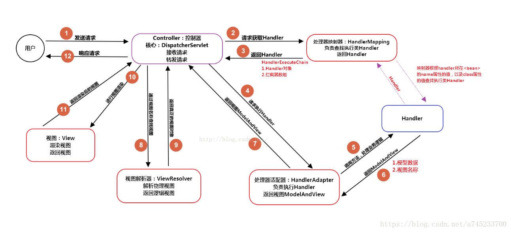

1. 什么是Spring MVC ？简单介绍下你对springMVC的理解?

    Spring MVC是一个基于Java的实现了MVC设计模式的请求驱动类型的轻量级Web框架，通过把Model，View，Controller分离，将web层进行职责解耦，把复杂的web应用分成逻辑清晰的几部分，简化开发，减少出错，方便组内开发人员之间的配合。

2. SpringMVC的流程？

    1. 用户发送请求至前端控制器DispatcherServlet；
    2.  DispatcherServlet收到请求后，调用HandlerMapping处理器映射器，请求获取Handle；
    3. 处理器映射器根据请求url找到具体的处理器，生成处理器对象及处理器拦截器(如果有则生成)一并返回给DispatcherServlet；
    4. DispatcherServlet 调用 HandlerAdapter处理器适配器；
    5. HandlerAdapter 经过适配调用 具体处理器(Handler，也叫后端控制器)；
    6. Handler执行完成返回ModelAndView；
    7. HandlerAdapter将Handler执行结果ModelAndView返回给DispatcherServlet；
    8. DispatcherServlet将ModelAndView传给ViewResolver视图解析器进行解析；
    9. ViewResolver解析后返回具体View；
    10. DispatcherServlet对View进行渲染视图（即将模型数据填充至视图中）
    11. DispatcherServlet响应用户。

    

3. Springmvc的优点:

    1. 可以支持各种视图技术,而不仅仅局限于JSP；

    2. 与Spring框架集成（如IoC容器、AOP等）；

    3. 清晰的角色分配：前端控制器(dispatcherServlet) , 请求到处理器映射（handlerMapping), 处理器适配器（HandlerAdapter), 视图解析器（ViewResolver）。

    4.  支持各种请求资源的映射策略。

4. Spring MVC的主要组件？

    1. 前端控制器 DispatcherServlet（不需要程序员开发）

        作用：接收请求、响应结果，相当于转发器，有了DispatcherServlet 就减少了其它组件之间的耦合度。

    2. 处理器映射器HandlerMapping（不需要程序员开发）

        作用：根据请求的URL来查找Handler

    3. 处理器适配器HandlerAdapter

        注意：在编写Handler的时候要按照HandlerAdapter要求的规则去编写，这样适配器HandlerAdapter才可以正确的去执行Handler。

    4. 处理器Handler（需要程序员开发）

    5. 视图解析器 ViewResolver（不需要程序员开发）

        作用：进行视图的解析，根据视图逻辑名解析成真正的视图（view）

    6. 视图View（需要程序员开发jsp）

        View是一个接口， 它的实现类支持不同的视图类型（jsp，freemarker，pdf等等）

5. springMVC和struts2的区别有哪些?

    1. springmvc的入口是一个servlet即前端控制器（DispatchServlet），而struts2入口是一个filter过虑器（StrutsPrepareAndExecuteFilter）。

    2. springmvc是基于方法开发(一个url对应一个方法)，请求参数传递到方法的形参，可以设计为单例或多例(建议单例)，struts2是基于类开发，传递参数是通过类的属性，只能设计为多例。

    3. Struts采用值栈存储请求和响应的数据，通过OGNL存取数据，springmvc通过参数解析器是将request请求内容解析，并给方法形参赋值，将数据和视图封装成ModelAndView对象，最后又将ModelAndView中的模型数据通过reques域传输到页面。Jsp视图解析器默认使用jstl。

 

6. SpringMVC怎么样设定重定向和转发的？

    1. 转发：在返回值前面加"forward:"，譬如"forward:user.do?name=method4"

    2. 重定向：在返回值前面加"redirect:"，譬如"redirect:http://www.baidu.com"

 

7. SpringMvc怎么和AJAX相互调用的？

    通过Jackson框架就可以把Java里面的对象直接转化成Js可以识别的Json对象。具体步骤如下 ：

    1. 加入Jackson.jar

    2. 在配置文件中配置json的映射

    3. 在接受Ajax方法里面可以直接返回Object,List等,但方法前面要加上@ResponseBody注解。

8. 如何解决POST请求中文乱码问题，GET的又如何处理呢？

    1. 解决post请求乱码问题：

        在web.xml中配置一个CharacterEncodingFilter过滤器，设置成utf-8；

        ```xml
        <filter>

            <filter-name>CharacterEncodingFilter</filter-name>

            <filter-class>org.springframework.web.filter.CharacterEncodingFilter</filter-class>

            <init-param>

                <param-name>encoding</param-name>

                <param-value>utf-8</param-value>

            </init-param>

        </filter>

        <filter-mapping>

            <filter-name>CharacterEncodingFilter</filter-name>

            <url-pattern>/*</url-pattern>

        </filter-mapping>
        ```

    2. get请求中文参数出现乱码解决方法有两个：

        1. 修改tomcat配置文件添加编码与工程编码一致，如下：

            ```xml
            <ConnectorURIEncoding="utf-8" connectionTimeout="20000" port="8080" protocol="HTTP/1.1" redirectPort="8443"/>
            ```

        2. 另外一种方法对参数进行重新编码：

            ```java
            String userName = new String(request.getParamter("userName").getBytes("ISO8859-1"),"utf-8")
            ```
            
            ISO8859-1是tomcat默认编码，需要将tomcat编码后的内容按utf-8编码。

9. Spring MVC的异常处理 ？

    可以将异常抛给Spring框架，由Spring框架来处理；我们只需要配置简单的异常处理器，在异常处理器中添视图页面即可。

10. SpringMvc的控制器是不是单例模式,如果是,有什么问题,怎么解决？

    是单例模式,所以在多线程访问的时候有线程安全问题,不要用同步,会影响性能的,解决方案是在控制器里面不能写字段。

11.  SpringMVC常用的注解有哪些？

    * @RequestMapping：用于处理请求 url 映射的注解，可用于类或方法上。用于类上，则表示类中的所有响应请求的方法都是以该地址作为父路径。

    * @RequestBody：注解实现接收http请求的json数据，将json转换为java对象。

    * @ResponseBody：注解实现将conreoller方法返回对象转化为json对象响应给客户。

12. SpingMvc中的控制器的注解一般用那个,有没有别的注解可以替代？

    一般用@Controller注解,也可以使用@RestController,@RestController注解相当于@ResponseBody ＋ @Controller,表示是表现层,除此之外，一般不用别的注解代替。

13. 如果在拦截请求中，我想拦截get方式提交的方法,怎么配置？

    可以在@RequestMapping注解里面加上method=RequestMethod.GET。

14. 怎样在方法里面得到Request,或者Session？

    直接在方法的形参中声明request,SpringMvc就自动把request对象传入。

15. 如果想在拦截的方法里面得到从前台传入的参数,怎么得到？

    直接在形参里面声明这个参数就可以,但必须名字和传过来的参数一样。

16. 如果前台有很多个参数传入,并且这些参数都是一个对象的,那么怎么样快速得到这个对象？

    直接在方法中声明这个对象,SpringMvc就自动会把属性赋值到这个对象里面。

17. SpringMvc中函数的返回值是什么？

    返回值可以有很多类型,有String, ModelAndView。ModelAndView类把视图和数据都合并的一起的，但一般用String比较好。

18. SpringMvc用什么对象从后台向前台传递数据的？

    通过ModelMap对象,可以在这个对象里面调用put方法,把对象加到里面,前台就可以通过el表达式拿到。

19. 怎么样把ModelMap里面的数据放入Session里面？

    可以在类上面加上@SessionAttributes注解,里面包含的字符串就是要放入session里面的key。

 
20. SpringMvc里面拦截器是怎么写的：

    有两种写法,一种是实现HandlerInterceptor接口，另外一种是继承适配器类，接着在接口方法当中，实现处理逻辑；然后在SpringMvc的配置文件中配置拦截器即可：

    ```xml
    <!-- 配置SpringMvc的拦截器 -->
 
    <mvc:interceptors>
    
        <!-- 配置一个拦截器的Bean就可以了 默认是对所有请求都拦截 -->
    
        <bean id="myInterceptor" class="com.zwp.action.MyHandlerInterceptor"></bean>
    
        <!-- 只针对部分请求拦截 -->
    
        <mvc:interceptor>
    
        <mvc:mapping path="/modelMap.do" />
    
        <bean class="com.zwp.action.MyHandlerInterceptorAdapter" />
    
        </mvc:interceptor>
    
    </mvc:interceptors>
    ```

21. 注解原理

    注解本质是一个继承了Annotation的特殊接口，其具体实现类是Java运行时生成的动态代理类。我们通过反射获取注解时，返回的是Java运行时生成的动态代理对象。通过代理对象调用自定义注解的方法，会最终调用AnnotationInvocationHandler的invoke方法。该方法会从memberValues这个Map中索引出对应的值。而memberValues的来源是Java常量池。

原文链接：https://blog.csdn.net/a745233700/article/details/80963758